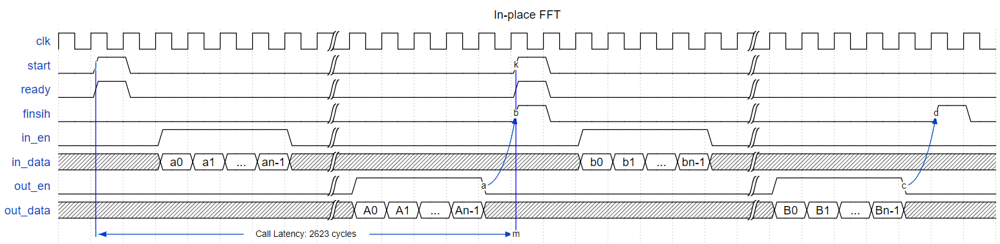

## [`fft`](../../include/hls_fft.hpp)

## Table of Contents:

**Functions**

> [`inplace_fft`](#function-fft)

**Examples**

> [Examples](#examples)

**Quality of Results**

> [Error Graph](#error-graph)

> [Resource Usage](#resource-usage)

### Function `fft`
~~~lua
template <unsigned SIZE>
void fft(hls::FIFO<fft_data_t>& fifo_in, hls::FIFO<fft_data_t>& fifo_out)
~~~

Compute the FFT. Note that fft_data_t type is defined as:
```cpp
struct fft_data_t {
ap_int<16> im;
ap_int<16> re;
};
```



**Template Parameters:**

* `unsigned SIZE`: the FFT transform size<br>

**Function Arguments:**

* `hls::FIFO<fft_data_t>& fifo_in`: reference to the input fifo, where the depth must match the FFT size<br>
* `hls::FIFO<fft_data_t>& fifo_out`: reference to the output fifo, where the depth must match the FFT size<br>

**Limitations:**

* The fft function currently only supports the radix-2, 256-point, forward inplace FFT implementation.

**Returns:**

No return.

## Examples

~~~lua
hls::dsp::fft<SIZE>(fifo_in, fifo_out);
~~~

The example used to gather the following graph and resource report can be found [here](../../examples/simple/fft).

## Error Graph


## Resource Usage

Using MPF300

fft using input signal y = 1000 \* sin\(2pi\*x\),
 256-Point Radix-2 forward inplace 


| Name        | Latency [cycles] (min/max/avg)   | II [cycles] (min/max/avg)   |   Real Avg Error |   Real Max Error |   Imaginary Avg Error |   Imaginary Max Error |   LUTs |   DFFs |   DSPs |   LSRAM |   uSRAM | Estimated Frequency   |
|-------------|----------------------------------|-----------------------------|------------------|------------------|-----------------------|-----------------------|--------|--------|--------|---------|---------|-----------------------|
| inplace_fft | 2,718 / 2,718 / 2,718.00         | 2,718 / 2,718 / 2,718.00    |          1.15234 |                4 |                1.0625 |                     4 |   2387 |   2412 |      6 |       4 |       0 | 263.296 MHz           |

Notes:
- Targeted FMax was 400MHz.


Back to [top](#).
