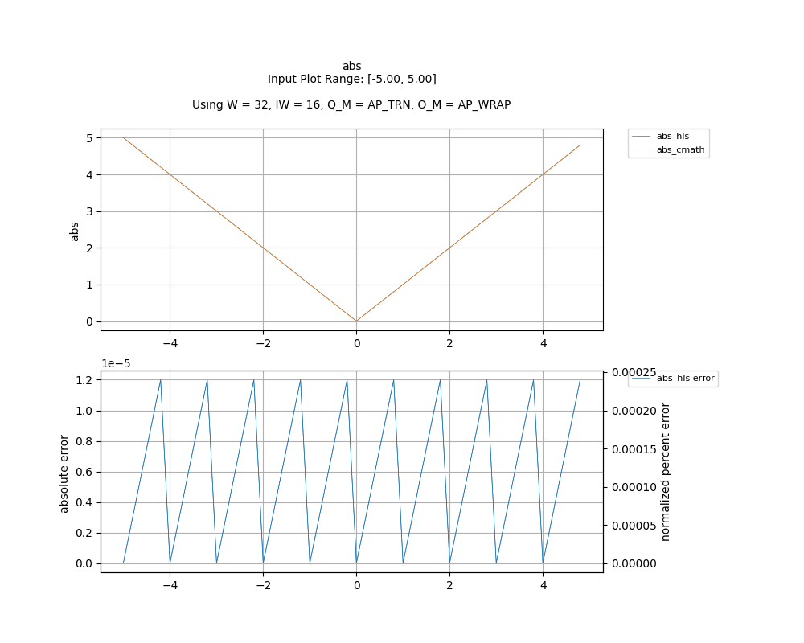

## [`abs`](../../include/hls_abs.hpp)

## Table of Contents:

**Functions**

> [`abs`](#function-abs)

**Examples**

> [Examples](#examples)

**Quality of Results**

> [Error Graph](#error-graph)

> [Resource Usage](#resource-usage)

### Function `abs`
~~~lua
template <unsigned int W_OUT, int IW_OUT, unsigned int W_IN, int IW_IN>
ap_fixpt<unsigned int W_OUT, int IW_OUT> abs(ap_fixpt<unsigned int W_IN, int IW_IN> fp)
~~~

Calculates absolute value.

**Template Parameters:**

- `unsigned int W_OUT`: width of the output
- `int IW_OUT`: width of integer portion of the output
- `unsigned int W_IN`: width of the input (automatically inferred)
- `int IW_IN`: width of integer portion of the input (automatically inferred)

**Function Arguments:**

- `ap_fixpt<unsigned int W_IN, int IW_IN> fp`: input

**Returns:**

- `ap_fixpt<unsigned int W_OUT, int IW_OUT>`: absolute value of the input
## Examples

~~~lua
  hls::ap_fixpt<10, 2> y = -3.1;

  auto x = hls::math::abs<32, 16>(y); //x will be a fixpt number with the value 3.1 

~~~

The example used to gather the following graph and resource report can be found [here](../../examples/simple/abs).

## Error Graph

## Resource Usage

Using MPF300

Input Plot Range: [-5.00, 5.00]
Using W = 32, IW = 16, Q_M = AP_TRN, O_M = AP_WRAP

| Name      | Latency [cycles] (min/max/avg)   | II [cycles] (min/max/avg)   |   Avg Error |   Max Error |   LUTs |   DFFs |   DSPs |   LSRAM |   uSRAM | Estimated Frequency   |
|-----------|----------------------------------|-----------------------------|-------------|-------------|--------|--------|--------|---------|---------|-----------------------|
| abs_cmath | 2 / 3 / 2.02                     | 1 / 2 / 1.02                |       0     |     0       |    133 |    130 |      0 |       0 |       0 | 750.188 MHz           |
| abs_hls   | 2 / 3 / 2.02                     | 1 / 2 / 1.02                |       6e-06 |     1.2e-05 |    103 |     68 |      0 |       0 |       0 | 750.188 MHz           |

Notes:
- The standard C math library uses floating point numbers.
- FMax is displayed as reported after RTL synthesis and may change during place and route.
- Targeted FMax was 400MHz.

Back to [top](#).