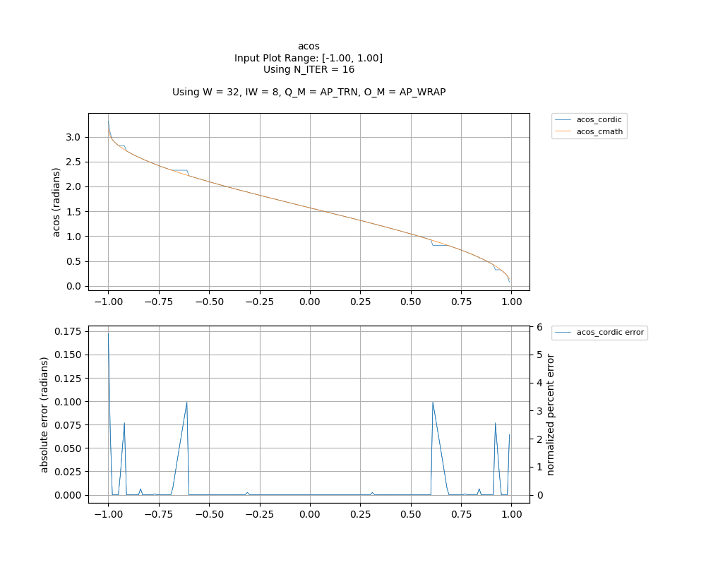

## [`acos`](../../include/hls_acos.hpp)

## Table of Contents:

**Functions**

> [`acos_cordic`](#function-acos_cordic)

**Examples**

> [Examples](#examples)

**Quality of Results**

> [Error Graph](#error-graph)

> [Resource Usage](#resource-usage)

### Function `acos_cordic`
~~~lua
template <unsigned int W_OUT, int IW_OUT, int N_ITERATIONS, unsigned int W_IN, int IW_IN>
ap_fixpt<unsigned int W_OUT, int IW_OUT> acos_cordic(ap_fixpt<unsigned int W_IN, int IW_IN> num, int error)
~~~

CORDIC implementation of arccos. Note that accuracy drops as input -> +/-1.If the input is not within [-1, 1], then an error will occur.

**Template Parameters:**

- `unsigned int W_OUT`: width of the output
- `int IW_OUT`: width of integer portion of the output
- `int N_ITERATIONS`: number of CORDIC iterations
- `unsigned int W_IN`: width of the input (automatically inferred)
- `int IW_IN`: width of integer portion of the input (automatically inferred)

**Function Arguments:**

- `ap_fixpt<unsigned int W_IN, int IW_IN> num`: input
- `int error`: variable to hold error code value if an error occurs

**Returns:**

- `ap_fixpt<unsigned int W_OUT, int IW_OUT>`: arccosine of input value (in radians)
## Examples

~~~lua
  hls::ap_fixpt<10, 2> y = 0.707;

  auto x = hls::math::acos_cordic<10, 2, 16>(y); // x will be an ap_fixpt number with the value 0.785549163 

~~~

The example used to gather the following graph and resource report can be found [here](../../examples/simple/acos).

## Error Graph

## Resource Usage

Using MPF300

Input Plot Range: [-1.00, 1.00]
Using N_ITER = 16
Using W = 32, IW = 8, Q_M = AP_TRN, O_M = AP_WRAP

| Name        | Latency [cycles] (min/max/avg)   | II [cycles] (min/max/avg)   |   Avg Error |   Max Error |   LUTs |   DFFs |   DSPs |   LSRAM |   uSRAM | Estimated Frequency   |
|-------------|----------------------------------|-----------------------------|-------------|-------------|--------|--------|--------|---------|---------|-----------------------|
| acos_cmath  | 7 / 503 / 345.39                 | 7 / 503 / 344.80            |    0        |    0        |  27075 |  34830 |     15 |       0 |       0 | 240.442 MHz           |
| acos_cordic | 37 / 38 / 37.00                  | 1 / 2 / 1.00                |    0.007499 |    0.172239 |   2810 |   7974 |      0 |       0 |       3 | 349.284 MHz           |

Notes:
- The standard C math library uses floating point numbers.
- Targeted FMax was 400MHz.

Back to [top](#).