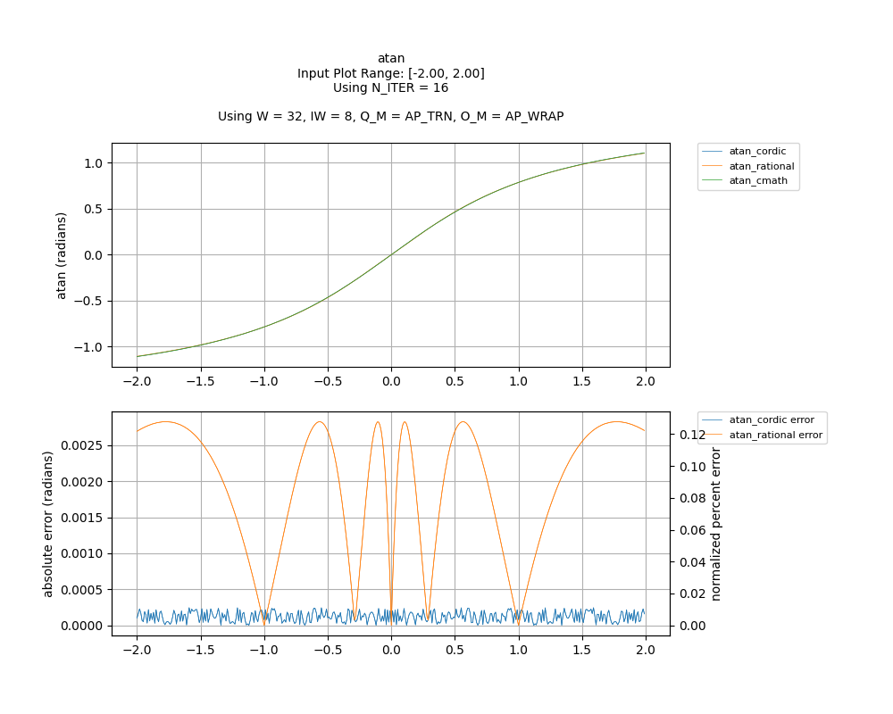
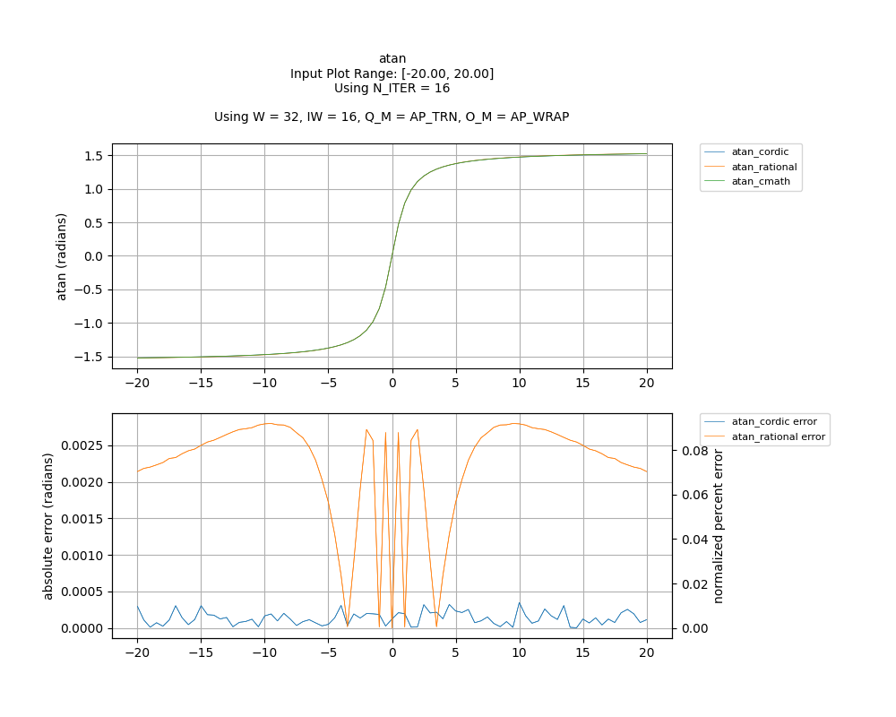

## [`atan`](../../include/hls_atan.hpp)

## Table of Contents:

**Functions**

> [`atan_rational`](#function-atan_rational)

> [`atan_cordic`](#function-atan_cordic)

**Examples**

> [Examples](#examples)

**Quality of Results**

> [Error Graph](#error-graph)

> [Resource Usage](#resource-usage)

### Function `atan_rational`
~~~lua
template <unsigned int W_OUT, int IW_OUT, unsigned int W_IN, int IW_IN>
ap_fixpt<unsigned int W_OUT, int IW_OUT> atan_rational(ap_fixpt<unsigned int W_IN, int IW_IN> num)
~~~

A rational function approximation of arctan.

**Template Parameters:**

- `unsigned int W_OUT`: width of the output
- `int IW_OUT`: width of integer portion of the output
- `unsigned int W_IN`: width of the input (automatically inferred)
- `int IW_IN`: width of integer portion of the input (automatically inferred)

**Function Arguments:**

- `ap_fixpt<unsigned int W_IN, int IW_IN> num`: input

**Returns:**

- `ap_fixpt<unsigned int W_OUT, int IW_OUT>`: arctangent of input value (in radians)
### Function `atan_cordic`
~~~lua
template <unsigned int W_OUT, int IW_OUT, int N_ITERATIONS, unsigned int W_IN, int IW_IN>
ap_fixpt<unsigned int W_OUT, int IW_OUT> atan_cordic(ap_fixpt<unsigned int W_IN, int IW_IN> num)
~~~

CORDIC implementation of arctan.

**Template Parameters:**

- `unsigned int W_OUT`: width of the output
- `int IW_OUT`: width of integer portion of the output
- `int N_ITERATIONS`: number of CORDIC iterations
- `unsigned int W_IN`: width of the input (automatically inferred)
- `int IW_IN`: width of integer portion of the input (automatically inferred)

**Function Arguments:**

- `ap_fixpt<unsigned int W_IN, int IW_IN> num`: input

**Returns:**

- `ap_fixpt<unsigned int W_OUT, int IW_OUT>`: arctangent of input value (in radians)
## Examples

~~~lua
  hls::ap_fixpt<10, 2> y = 1;

  auto x = hls::math::atan_rational<10, 2>(y); // x will be an ap_fixpt number with the value 0.785398163

~~~
~~~lua
  hls::ap_fixpt<10, 2> y = 1;

  auto x = hls::math::atan_cordic<10, 2, 16>(y); // x will be an ap_fixpt number with the value 0.785398163

~~~

The example used to gather the following graph and resource report can be found [here](../../examples/simple/atan).

## Error Graph

## Resource Usage

Using MPF300

Input Plot Range: [-2.00, 2.00]
Using N_ITER = 16
Using W = 32, IW = 8, Q_M = AP_TRN, O_M = AP_WRAP

| Name          | Latency [cycles] (min/max/avg)   | II [cycles] (min/max/avg)   |   Avg Error |   Max Error |   LUTs |   DFFs |   DSPs |   LSRAM |   uSRAM | Estimated Frequency   |
|---------------|----------------------------------|-----------------------------|-------------|-------------|--------|--------|--------|---------|---------|-----------------------|
| atan_cmath    | 308 / 308 / 308.00               | 17 / 17 / 17.00             |    0        |    0        |  15136 |  23146 |      9 |       0 |       6 | 277.932 MHz           |
| atan_cordic   | 39 / 40 / 39.00                  | 1 / 2 / 1.00                |    0.00012  |    0.000244 |   3048 |   9644 |      0 |       0 |       3 | 446.030 MHz           |
| atan_rational | 80 / 81 / 80.00                  | 1 / 2 / 1.00                |    0.001957 |    0.002828 |   9865 |  13451 |     14 |       0 |       0 | 307.882 MHz           |

Input Plot Range: [-20.00, 20.00]
Using N_ITER = 16
Using W = 32, IW = 16, Q_M = AP_TRN, O_M = AP_WRAP

| Name          | Latency [cycles] (min/max/avg)   | II [cycles] (min/max/avg)   |   Avg Error |   Max Error |   LUTs |   DFFs |   DSPs |   LSRAM |   uSRAM | Estimated Frequency   |
|---------------|----------------------------------|-----------------------------|-------------|-------------|--------|--------|--------|---------|---------|-----------------------|
| atan_cmath    | 308 / 308 / 308.00               | 17 / 17 / 17.00             |    0        |    0        |  15136 |  23146 |      9 |       0 |       6 | 277.932 MHz           |
| atan_cordic   | 43 / 44 / 43.01                  | 1 / 2 / 1.01                |    0.000134 |    0.000348 |   3393 |  11224 |      0 |       0 |       6 | 435.161 MHz           |
| atan_rational | 77 / 78 / 77.01                  | 1 / 2 / 1.01                |    0.002222 |    0.0028   |   9298 |  12936 |     10 |       0 |       0 | 345.185 MHz           |

Notes:
- The standard C math library uses floating point numbers.
- Targeted FMax was 400MHz.

Back to [top](#).