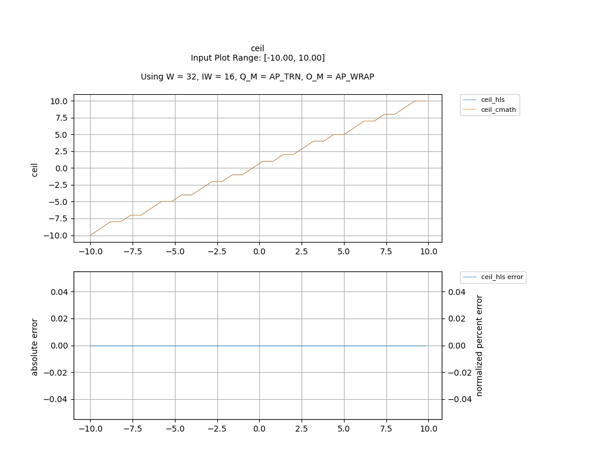

## [`ceil`](../../include/hls_ceil.hpp)

## Table of Contents:

**Functions**

> [`ceil`](#function-ceil)

**Examples**

> [Examples](#examples)

**Quality of Results**

> [Error Graph](#error-graph)

> [Resource Usage](#resource-usage)

### Function `ceil`
~~~lua
template <unsigned int W_OUT, int IW_OUT, unsigned int W_IN, int IW_IN>
ap_fixpt<unsigned int W_OUT, int IW_OUT> ceil(ap_fixpt<unsigned int W_IN, int IW_IN> input)
~~~

Rounds the input upwards.

**Template Parameters:**

- `unsigned int W_OUT`: width of the output
- `int IW_OUT`: width of integer portion of the output
- `unsigned int W_IN`: width of the input (automatically inferred)
- `int IW_IN`: width of integer portion of the input (automatically inferred)

**Function Arguments:**

- `ap_fixpt<unsigned int W_IN, int IW_IN> input`: None

**Returns:**

- `ap_fixpt<unsigned int W_OUT, int IW_OUT>`: smallest integer value that is not less than the input
## Examples

~~~lua
  hls::ap_fixpt<10, 2> x = 12.222;

  auto y = hls::math::ceil<32, 16>(x) // y will be an ap_fixpt number with a value of 13

~~~

The example used to gather the following graph and resource report can be found [here](../../examples/simple/ceil).

## Error Graph

## Resource Usage

Using MPF300

Input Plot Range: [-10.00, 10.00]
Using W = 32, IW = 16, Q_M = AP_TRN, O_M = AP_WRAP

| Name       | Latency [cycles] (min/max/avg)   | II [cycles] (min/max/avg)   |   Avg Error |   Max Error |   LUTs |   DFFs |   DSPs |   LSRAM |   uSRAM | Estimated Frequency   |
|------------|----------------------------------|-----------------------------|-------------|-------------|--------|--------|--------|---------|---------|-----------------------|
| ceil_cmath | 19 / 19 / 19.00                  | 2 / 2 / 2.00                |           0 |           0 |   3127 |   6356 |      0 |       0 |       0 | 407.997 MHz           |
| ceil_hls   | 3 / 4 / 3.03                     | 1 / 2 / 1.03                |           0 |           0 |     93 |     68 |      0 |       0 |       0 | 935.454 MHz           |

Notes:
- The standard C math library uses floating point numbers.
- Targeted FMax was 400MHz.

Back to [top](#).