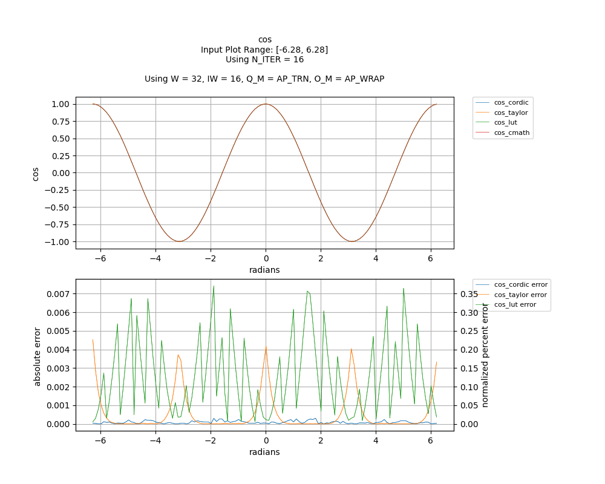

## [`cos`](../../include/hls_cos.hpp)

## Table of Contents:

**Functions**

> [`cos_cordic`](#function-cos_cordic)

> [`cos_taylor`](#function-cos_taylor)

> [`cos_lut`](#function-cos_lut)

**Examples**

> [Examples](#examples)

**Quality of Results**

> [Error Graph](#error-graph)

> [Resource Usage](#resource-usage)

### Function `cos_cordic`
~~~lua
template <unsigned int W_OUT, int IW_OUT, int N_ITERATIONS, unsigned int W_IN, int IW_IN>
ap_fixpt<unsigned int W_OUT, int IW_OUT> cos_cordic(ap_fixpt<unsigned int W_IN, int IW_IN> x)
~~~

CORDIC implementation of cos.

**Template Parameters:**

- `unsigned int W_OUT`: width of the output
- `int IW_OUT`: width of integer portion of the output
- `int N_ITERATIONS`: number of CORDIC iterations
- `unsigned int W_IN`: width of the input (automatically inferred)
- `int IW_IN`: width of integer portion of the input (automatically inferred)

**Function Arguments:**

- `ap_fixpt<unsigned int W_IN, int IW_IN> x`: angle (in radians)

**Returns:**

- `ap_fixpt<unsigned int W_OUT, int IW_OUT>`: cosine of input angle
### Function `cos_taylor`
~~~lua
template <unsigned int W_OUT, int IW_OUT, unsigned int W_IN, int IW_IN>
ap_fixpt<unsigned int W_OUT, int IW_OUT> cos_taylor(ap_fixpt<unsigned int W_IN, int IW_IN> x)
~~~

2-term Taylor Series implementation of cos.

**Template Parameters:**

- `unsigned int W_OUT`: width of the output
- `int IW_OUT`: width of integer portion of the output
- `unsigned int W_IN`: width of the input (automatically inferred)
- `int IW_IN`: width of integer portion of the input (automatically inferred)

**Function Arguments:**

- `ap_fixpt<unsigned int W_IN, int IW_IN> x`: angle (in radians)

**Returns:**

- `ap_fixpt<unsigned int W_OUT, int IW_OUT>`: cosine of input angle
### Function `cos_lut`
~~~lua
template <unsigned int W_OUT, int IW_OUT, unsigned int W_IN, int IW_IN>
ap_fixpt<unsigned int W_OUT, int IW_OUT> cos_lut(ap_fixpt<unsigned int W_IN, int IW_IN> x)
~~~

Lookup Table implementation of cos.Number of decimal bits of input value is recommended to be less than DECIM (defined in utils/generators/generated_tables/sin_lut_table.hpp)See utils/generators/sin_lut_gentable.cpp to generate your own tables.

**Template Parameters:**

- `unsigned int W_OUT`: width of the output
- `int IW_OUT`: width of integer portion of the output
- `unsigned int W_IN`: width of the input (automatically inferred)
- `int IW_IN`: width of integer portion of the input (automatically inferred)

**Function Arguments:**

- `ap_fixpt<unsigned int W_IN, int IW_IN> x`: angle (in radians)

**Returns:**

- `ap_fixpt<unsigned int W_OUT, int IW_OUT>`: cosine of input angle
## Examples

~~~lua
  hls::ap_fixpt<10, 2> y = 3.1415;

  auto x = hls::math::cos_cordic<10, 2, 16>(y); //x will be an ap_fixpt w/ the value 1

~~~
~~~lua
  hls::ap_fixpt<10, 2> y = 3.1415;

  auto x = hls::math::cos_taylor<10, 2>(y); //x will be an ap_fixpt w/ the value 1

~~~
~~~lua
  hls::ap_fixpt<10, 2> y = 3.1415;

  auto x = hls::math::cos_lut<10, 2>(y); //x will be an ap_fixpt w/ the value 1

~~~

The example used to gather the following graph and resource report can be found [here](../../examples/simple/cos).

## Error Graph

## Resource Usage

Using MPF300

Input Plot Range: [-12.57, 12.57]
Using N_ITER = 16
Using W = 32, IW = 16, Q_M = AP_TRN, O_M = AP_WRAP

| Name       | Latency [cycles] (min/max/avg)   | II [cycles] (min/max/avg)   |   Avg Error |   Max Error |   LUTs |   DFFs |   DSPs |   LSRAM |   uSRAM | Estimated Frequency   |
|------------|----------------------------------|-----------------------------|-------------|-------------|--------|--------|--------|---------|---------|-----------------------|
| cos_cmath  | 173 / 297 / 260.25               | 173 / 297 / 260.23          |    0        |    0        |  27057 |  24679 |     18 |       5 |      27 | 146.306 MHz           |
| cos_cordic | 40 / 41 / 40.00                  | 1 / 2 / 1.00                |    8.6e-05  |    0.000302 |   1800 |   4025 |      0 |       0 |       0 | 573.394 MHz           |
| cos_taylor | 41 / 42 / 41.00                  | 1 / 2 / 1.00                |    0.000577 |    0.004517 |   3409 |   5890 |     15 |       0 |       0 | 442.282 MHz           |
| cos_lut    | 40 / 41 / 40.00                  | 1 / 2 / 1.00                |    0.002595 |    0.007739 |   2455 |   4799 |      6 |       0 |       0 | 519.211 MHz           |

Notes:
- The standard C math library uses floating point numbers.
- Targeted FMax was 400MHz.

Back to [top](#).