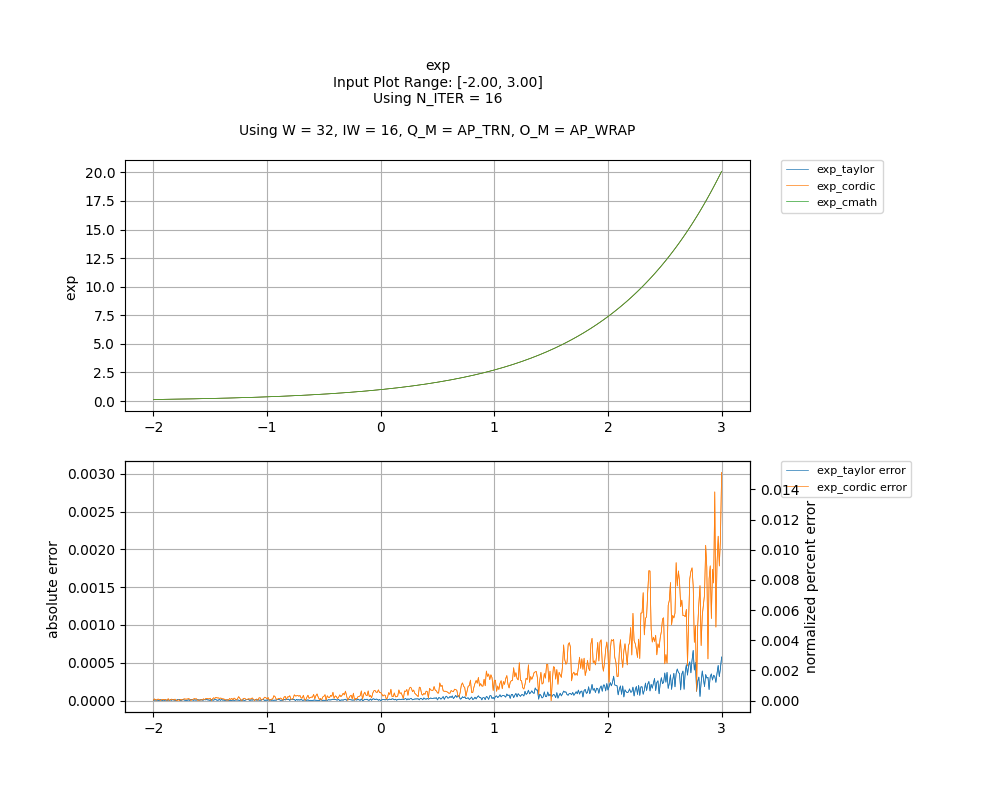
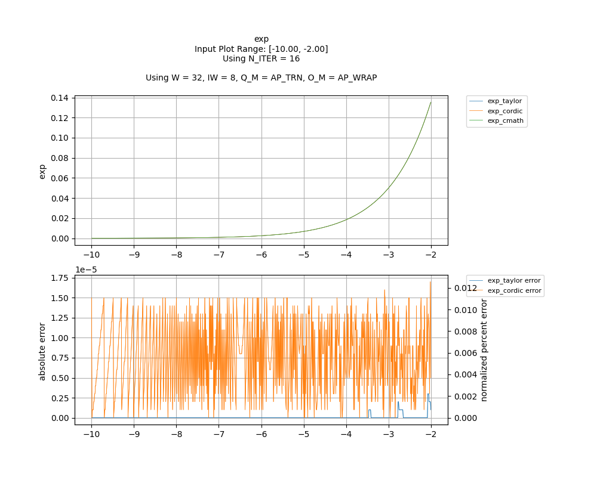

## [`exp`](../../include/hls_exp.hpp)

## Table of Contents:

**Functions**

> [`exp_taylor`](#function-exp_taylor)

> [`exp_cordic`](#function-exp_cordic)

**Examples**

> [Examples](#examples)

**Quality of Results**

> [Error Graph](#error-graph)

> [Resource Usage](#resource-usage)

### Function `exp_taylor`
~~~lua
template <unsigned int W_OUT, int IW_OUT, unsigned int W_IN, int IW_IN>
ap_fixpt<unsigned int W_OUT, int IW_OUT> exp_taylor(ap_fixpt<unsigned int W_IN, int IW_IN> fp)
~~~

6-term Taylor Series implementation of exp.

**Template Parameters:**

- `unsigned int W_OUT`: width of the output
- `int IW_OUT`: width of integer portion of the output
- `unsigned int W_IN`: width of the input (automatically inferred)
- `int IW_IN`: width of integer portion of the input (automatically inferred)

**Function Arguments:**

- `ap_fixpt<unsigned int W_IN, int IW_IN> fp`: input

**Returns:**

- `ap_fixpt<unsigned int W_OUT, int IW_OUT>`: e raised to the power of the input
### Function `exp_cordic`
~~~lua
template <unsigned int W_OUT, int IW_OUT, int N_ITERATIONS, unsigned int W_IN, int IW_IN>
ap_fixpt<unsigned int W_OUT, int IW_OUT> exp_cordic(ap_fixpt<unsigned int W_IN, int IW_IN> fp)
~~~

CORDIC implementation of exp.Takes in x as a fixed point number, returns exp(x).

**Template Parameters:**

- `unsigned int W_OUT`: width of the output
- `int IW_OUT`: width of integer portion of the output
- `int N_ITERATIONS`: number of CORDIC iterations
- `unsigned int W_IN`: width of the input (automatically inferred)
- `int IW_IN`: width of integer portion of the input (automatically inferred)

**Function Arguments:**

- `ap_fixpt<unsigned int W_IN, int IW_IN> fp`: Input

**Returns:**

- `ap_fixpt<unsigned int W_OUT, int IW_OUT>`: e raised to the power of the input
## Examples

~~~lua
  hls::ap_fixpt<10, 2> y = 2;

  auto x = hls::math::exp_taylor<10, 2>(y); //x will be an ap_fixpt w/ the value 7.3890560989

~~~
~~~lua
  hls::ap_fixpt<10, 2> y = 2;

  auto x = hls::math::exp_cordic<10, 2, 16>(y); //x will be an ap_fixpt w/ the value 7.3890560989

~~~

The example used to gather the following graph and resource report can be found [here](../../examples/simple/exp).

## Error Graph

## Resource Usage

Using MPF300

Input Plot Range: [-2.00, 3.00]
Using N_ITER = 16
Using W = 32, IW = 16, Q_M = AP_TRN, O_M = AP_WRAP

| Name       | Latency [cycles] (min/max/avg)   | II [cycles] (min/max/avg)   |   Avg Error |   Max Error |   LUTs |   DFFs |   DSPs |   LSRAM |   uSRAM | Estimated Frequency   |
|------------|----------------------------------|-----------------------------|-------------|-------------|--------|--------|--------|---------|---------|-----------------------|
| exp_cmath  | 260 / 260 / 260.00               | 17 / 17 / 17.00             |    0        |    0        |   8206 |  15085 |      9 |       4 |       0 | 350.263 MHz           |
| exp_taylor | 43 / 44 / 43.00                  | 1 / 2 / 1.00                |    7.9e-05  |    0.000664 |   3791 |   4537 |     54 |       0 |      16 | 449.843 MHz           |
| exp_cordic | 31 / 32 / 31.00                  | 1 / 2 / 1.00                |    0.000339 |    0.003017 |   1949 |   2793 |     12 |       0 |       0 | 484.496 MHz           |

Input Plot Range: [-10.00, -2.00]
Using N_ITER = 16
Using W = 32, IW = 8, Q_M = AP_TRN, O_M = AP_WRAP

| Name       | Latency [cycles] (min/max/avg)   | II [cycles] (min/max/avg)   |   Avg Error |   Max Error |   LUTs |   DFFs |   DSPs |   LSRAM |   uSRAM | Estimated Frequency   |
|------------|----------------------------------|-----------------------------|-------------|-------------|--------|--------|--------|---------|---------|-----------------------|
| exp_cmath  | 260 / 260 / 260.00               | 17 / 17 / 17.00             |       0     |     0       |   8206 |  15085 |      9 |       4 |       0 | 350.263 MHz           |
| exp_taylor | 50 / 51 / 50.00                  | 1 / 2 / 1.00                |       0     |     3e-06   |   5565 |   6567 |     74 |       0 |      27 | 444.050 MHz           |
| exp_cordic | 42 / 43 / 42.00                  | 1 / 2 / 1.00                |       8e-06 |     1.7e-05 |   3266 |   3765 |     16 |       0 |       8 | 451.467 MHz           |

Notes:
- The standard C math library uses floating point numbers.
- Targeted FMax was 400MHz.

Back to [top](#).