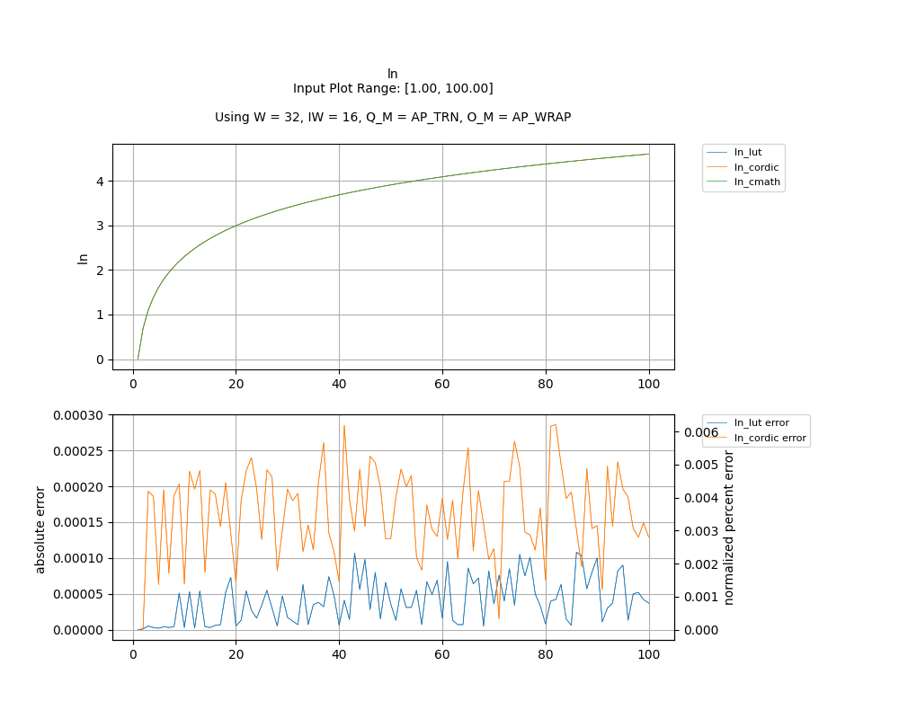
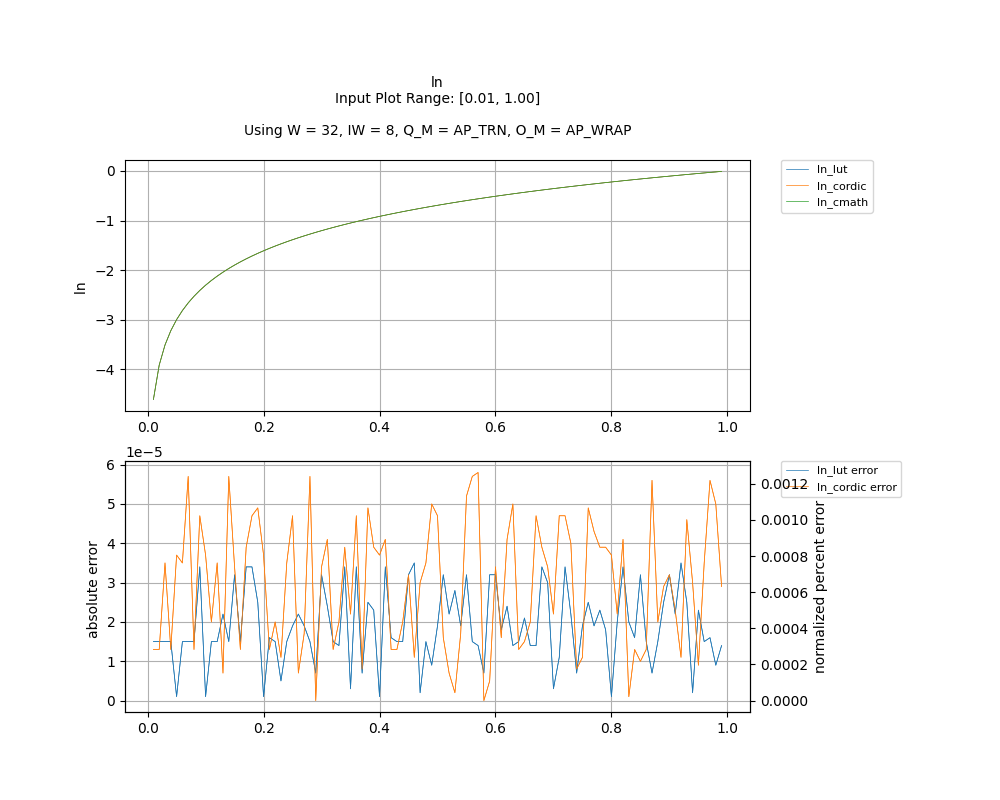

## [`ln`](../../include/hls_ln.hpp)

## Table of Contents:

**Functions**

> [`ln_lut`](#function-ln_lut)

> [`ln_cordic`](#function-ln_cordic)

**Examples**

> [Examples](#examples)

**Quality of Results**

> [Error Graph](#error-graph)

> [Resource Usage](#resource-usage)

### Function `ln_lut`
~~~lua
template <unsigned int W_OUT, int IW_OUT, unsigned int W_IN, int IW_IN>
ap_fixpt<unsigned int W_OUT, int IW_OUT> ln_lut(ap_fixpt<unsigned int W_IN, int IW_IN> num, int error)
~~~

Lookup Table based implementation of ln. Uses the lookup implementation of log2. If the input is negative, then an error will occur.

**Template Parameters:**

- `unsigned int W_OUT`: width of the output
- `int IW_OUT`: width of integer portion of the output
- `unsigned int W_IN`: width of the input (automatically inferred)
- `int IW_IN`: width of integer portion of the input (automatically inferred)

**Function Arguments:**

- `ap_fixpt<unsigned int W_IN, int IW_IN> num`: input
- `int error`: variable to hold error code value if an error occurs

**Returns:**

- `ap_fixpt<unsigned int W_OUT, int IW_OUT>`: natural logarithm of the input value
### Function `ln_cordic`
~~~lua
template <unsigned int W_OUT, int IW_OUT, int N_ITERATIONS, unsigned int W_IN, int IW_IN>
ap_fixpt<unsigned int W_OUT, int IW_OUT> ln_cordic(ap_fixpt<unsigned int W_IN, int IW_IN> num, int error)
~~~

CORDIC based implementation of ln. Uses the lookup implementation of log2. If the input is negative, then an error will occur.

**Template Parameters:**

- `unsigned int W_OUT`: width of the output
- `int IW_OUT`: width of integer portion of the output
- `int N_ITERATIONS`: number of CORDIC iterations
- `unsigned int W_IN`: width of the input (automatically inferred)
- `int IW_IN`: width of integer portion of the input (automatically inferred)

**Function Arguments:**

- `ap_fixpt<unsigned int W_IN, int IW_IN> num`: input
- `int error`: variable to hold error code value if an error occurs

**Returns:**

- `ap_fixpt<unsigned int W_OUT, int IW_OUT>`: natural logarithm of the input value
## Examples

~~~lua
  hls::ap_fixpt<10, 2> y = 2;

  auto x = hls::math::ln_lut<10, 2>(y); //x will be an ap_fixpt w/ the value 0.69314718055995

~~~
~~~lua
  hls::ap_fixpt<10, 2> y = 2;

  auto x = hls::math::ln_cordic<10, 2, 16>(y); //x will be an ap_fixpt w/ the value 0.69314718055995

~~~

The example used to gather the following graph and resource report can be found [here](../../examples/simple/ln).

## Error Graph

## Resource Usage

Using MPF300

Input Plot Range: [1.00, 100.00]
Using W = 32, IW = 16, Q_M = AP_TRN, O_M = AP_WRAP

| Name      | Latency [cycles] (min/max/avg)   | II [cycles] (min/max/avg)   |   Avg Error |   Max Error |   LUTs |   DFFs |   DSPs |   LSRAM |   uSRAM | Estimated Frequency   |
|-----------|----------------------------------|-----------------------------|-------------|-------------|--------|--------|--------|---------|---------|-----------------------|
| ln_cmath  | 186 / 186 / 186.00               | 28 / 28 / 28.00             |    0        |    0        |  16205 |  23310 |      9 |       6 |       0 | 343.525 MHz           |
| ln_lut    | 121 / 122 / 121.01               | 1 / 2 / 1.01                |    4e-05    |    0.000108 |   3307 |   6446 |      5 |       1 |       2 | 343.525 MHz           |
| ln_cordic | 96 / 97 / 96.01                  | 1 / 2 / 1.01                |    0.000162 |    0.000286 |   3480 |   5197 |     12 |       0 |       5 | 343.525 MHz           |

Input Plot Range: [0.01, 1.00]
Using W = 32, IW = 8, Q_M = AP_TRN, O_M = AP_WRAP

| Name      | Latency [cycles] (min/max/avg)   | II [cycles] (min/max/avg)   |   Avg Error |   Max Error |   LUTs |   DFFs |   DSPs |   LSRAM |   uSRAM | Estimated Frequency   |
|-----------|----------------------------------|-----------------------------|-------------|-------------|--------|--------|--------|---------|---------|-----------------------|
| ln_cmath  | 186 / 186 / 186.00               | 28 / 28 / 28.00             |     0       |     0       |  16205 |  23310 |      9 |       6 |       0 | 343.525 MHz           |
| ln_lut    | 121 / 122 / 121.01               | 1 / 2 / 1.01                |     1.9e-05 |     3.5e-05 |   3471 |   6634 |      5 |       1 |       1 | 343.525 MHz           |
| ln_cordic | 96 / 97 / 96.01                  | 1 / 2 / 1.01                |     2.9e-05 |     5.8e-05 |   3837 |   5411 |     12 |       0 |       4 | 343.525 MHz           |

Notes:
- The standard C math library uses floating point numbers.
- FMax is displayed as reported after RTL synthesis and may change during place and route.
- Targeted FMax was 400MHz.

Back to [top](#).