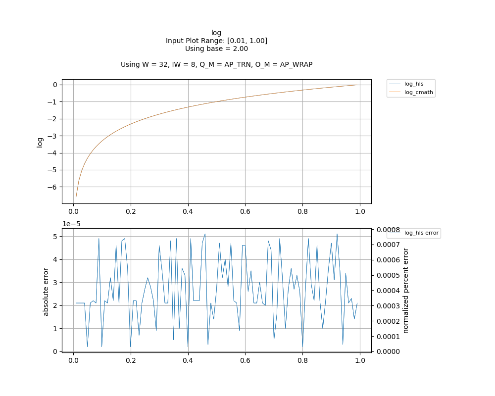
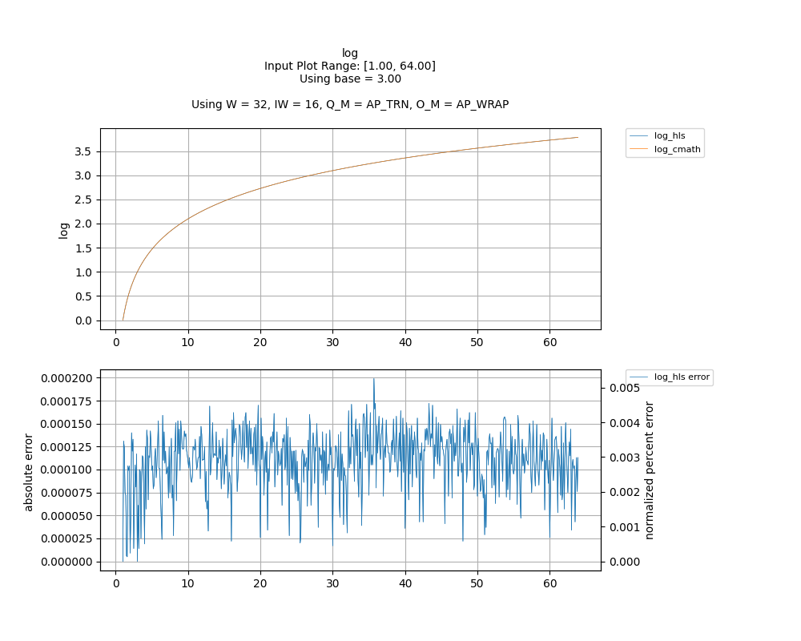
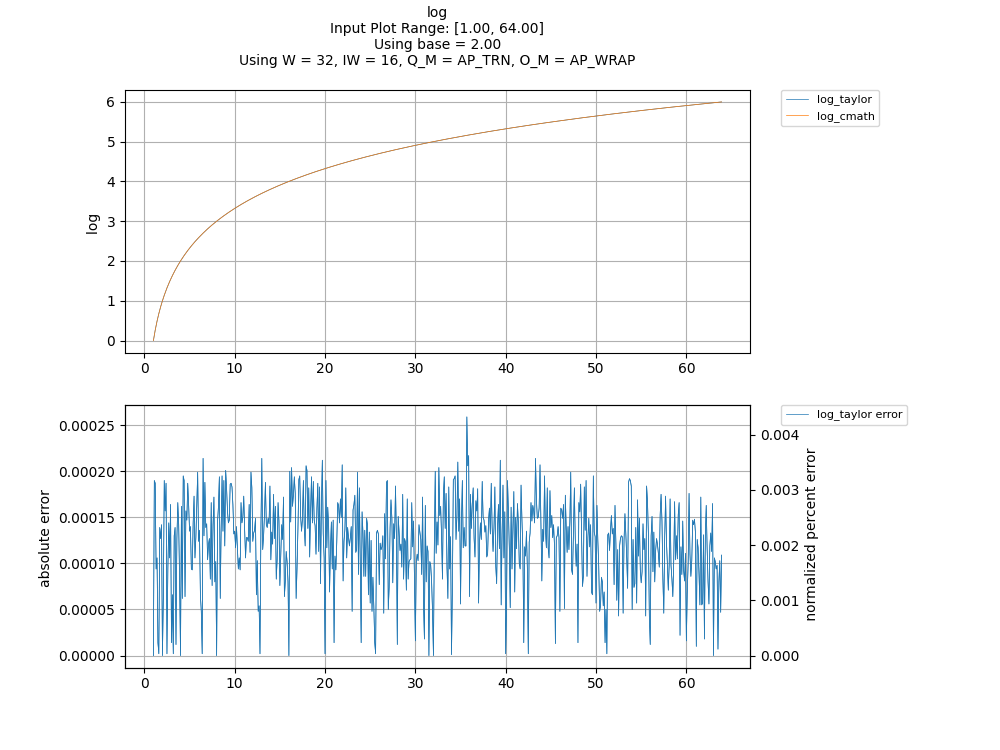

## [`log`](../../include/hls_log.hpp)

## Table of Contents:

**Functions**

> [`log`](#function-log)

**Examples**

> [Examples](#examples)

**Quality of Results**

> [Error Graph](#error-graph)

> [Resource Usage](#resource-usage)

### Function `log`
~~~lua
template <unsigned int W_OUT, int IW_OUT, unsigned int W_IN, int IW_IN>
ap_fixpt<unsigned int W_OUT, int IW_OUT> log(ap_fixpt<unsigned int W_IN, int IW_IN> x, ap_fixpt<unsigned int W_IN, int IW_IN> base, int error)
~~~

Lookup Table based implementation of log based on the lookup table implementation of log2.If input is negative, then an error will occur.Negative bases are not supported yet, and will result in a NaN error.

**Template Parameters:**

- `unsigned int W_OUT`: width of the output
- `int IW_OUT`: width of integer portion of the output
- `unsigned int W_IN`: width of the input (automatically inferred)
- `int IW_IN`: width of integer portion of the input (automatically inferred)

**Function Arguments:**

- `ap_fixpt<unsigned int W_IN, int IW_IN> x`: input
- `ap_fixpt<unsigned int W_IN, int IW_IN> base`: log base
- `int error`: variable to hold error code value if an error occurs

**Returns:**

- `ap_fixpt<unsigned int W_OUT, int IW_OUT>`: log of input value with base
## Examples

~~~lua
  hls::ap_fixpt<10, 2> y = 4;

  hls::ap_fixpt<10, 3> base = 2;

  auto x = hls::math::log<10, 2>(y, base); //x will be an ap_fixpt w/ the value 2

~~~

The example used to gather the following graph and resource report can be found [here](../../examples/simple/log).

## Error Graph

## Resource Usage

Using MPF300

Input Plot Range: [0.01, 1.00]
Using base = 2.00
Using W = 32, IW = 8, Q_M = AP_TRN, O_M = AP_WRAP

| Name      | Latency [cycles] (min/max/avg)   | II [cycles] (min/max/avg)   |   Avg Error |   Max Error |   LUTs |   DFFs |   DSPs |   LSRAM |   uSRAM | Estimated Frequency   |
|-----------|----------------------------------|-----------------------------|-------------|-------------|--------|--------|--------|---------|---------|-----------------------|
| log_cmath | 308 / 308 / 308.00               | 56 / 56 / 56.00             |     0       |     0       |  21237 |  27633 |      9 |       6 |       0 | 335.796 MHz           |
| log_hls   | 180 / 181 / 180.01               | 1 / 2 / 1.01                |     2.7e-05 |     2.1e-05 |  14855 |  23500 |      0 |       3 |       2 | 335.796 MHz           |

Input Plot Range: [1.00, 64.00]
Using base = 3.00
Using W = 32, IW = 16, Q_M = AP_TRN, O_M = AP_WRAP

| Name      | Latency [cycles] (min/max/avg)   | II [cycles] (min/max/avg)   |   Avg Error |   Max Error |   LUTs |   DFFs |   DSPs |   LSRAM |   uSRAM | Estimated Frequency   |
|-----------|----------------------------------|-----------------------------|-------------|-------------|--------|--------|--------|---------|---------|-----------------------|
| log_cmath | 308 / 308 / 308.00               | 56 / 56 / 56.00             |    0        |    0        |  21237 |  27633 |      9 |       6 |       0 | 335.796 MHz           |
| log_hls   | 180 / 181 / 180.00               | 1 / 2 / 1.00                |    0.000111 |    0.000113 |  14572 |  23599 |      0 |       3 |       4 | 335.796 MHz           |

Input Plot Range: [1.00, 64.00]
Using base = 2.00
Using W = 32, IW = 16, Q_M = AP_TRN, O_M = AP_WRAP

| Name      | Latency [cycles] (min/max/avg)   | II [cycles] (min/max/avg)   |   Avg Error |   Max Error |   LUTs |   DFFs |   DSPs |   LSRAM |   uSRAM | Estimated Frequency   |
|-----------|----------------------------------|-----------------------------|-------------|-------------|--------|--------|--------|---------|---------|-----------------------|
| log_cmath | 308 / 308 / 308.00               | 56 / 56 / 56.00             |    0        |    0        |  21237 |  27633 |      9 |       6 |       0 | 335.796 MHz           |
| log_hls   | 180 / 181 / 180.00               | 1 / 2 / 1.00                |    0.000123 |    0.000109 |  14572 |  23599 |      0 |       3 |       4 | 335.796 MHz           |

Notes:
- The standard C math library uses floating point numbers.
- FMax is displayed as reported after RTL synthesis and may change during place and route.
- Targeted FMax was 400MHz.

Back to [top](#).