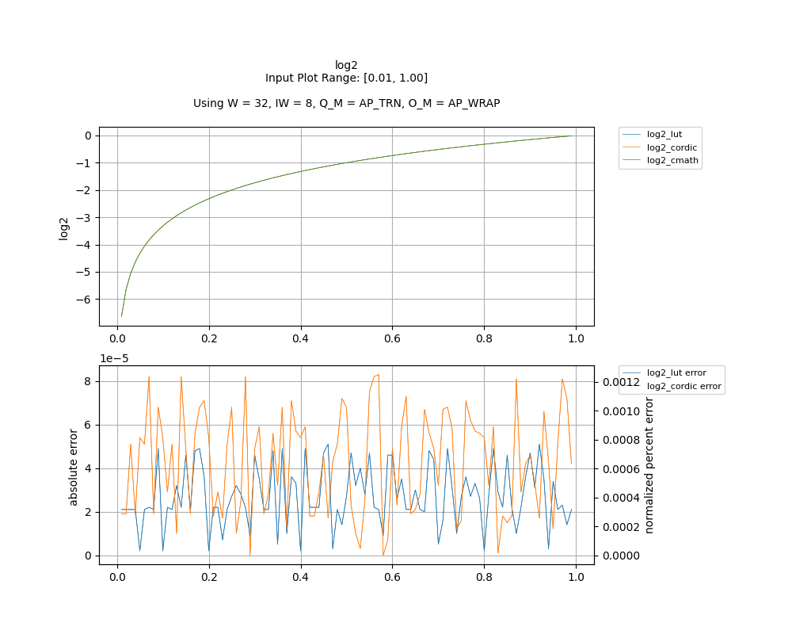
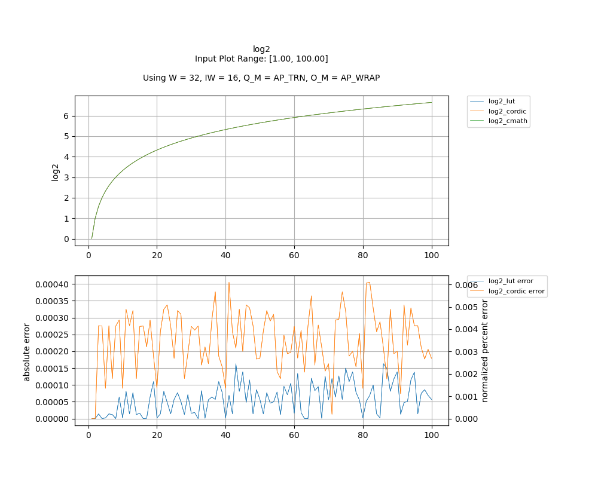

## [`log2`](../../include/hls_log2.hpp)

## Table of Contents:

**Functions**

> [`log2_lut`](#function-log2_lut)

> [`log2_cordic`](#function-log2_cordic)

**Examples**

> [Examples](#examples)

**Quality of Results**

> [Error Graph](#error-graph)

> [Resource Usage](#resource-usage)

### Function `log2_lut`
~~~lua
template <unsigned int W_OUT, int IW_OUT, unsigned int W_IN, int IW_IN>
ap_fixpt<unsigned int W_OUT, int IW_OUT> log2_lut(ap_fixpt<unsigned int W_IN, int IW_IN> num, int error)
~~~

Lookup Table based implementation of log base 2. If input is negative, then an error will occur.

**Template Parameters:**

- `unsigned int W_OUT`: width of the output
- `int IW_OUT`: width of integer portion of the output
- `unsigned int W_IN`: width of the input (automatically inferred)
- `int IW_IN`: width of integer portion of the input (automatically inferred)

**Function Arguments:**

- `ap_fixpt<unsigned int W_IN, int IW_IN> num`: input
- `int error`: variable to hold error code value if an error occurs

**Returns:**

- `ap_fixpt<unsigned int W_OUT, int IW_OUT>`: log2 of input value
### Function `log2_cordic`
~~~lua
template <unsigned int W_OUT, int IW_OUT, int N_ITERATIONS, unsigned int W_IN, int IW_IN>
ap_fixpt<unsigned int W_OUT, int IW_OUT> log2_cordic(ap_fixpt<unsigned int W_IN, int IW_IN> num, int error)
~~~

CORDIC based implementation of log base 2. If input is negative, then an error will occur.

**Template Parameters:**

- `unsigned int W_OUT`: width of the output
- `int IW_OUT`: width of integer portion of the output
- `int N_ITERATIONS`: number of CORDIC iterations
- `unsigned int W_IN`: width of the input (automatically inferred)
- `int IW_IN`: width of integer portion of the input (automatically inferred)

**Function Arguments:**

- `ap_fixpt<unsigned int W_IN, int IW_IN> num`: input
- `int error`: variable to hold error code value if an error occurs

**Returns:**

- `ap_fixpt<unsigned int W_OUT, int IW_OUT>`: log2 of input value
## Examples

~~~lua
  hls::ap_fixpt<10, 2> y = 4;

  auto x = hls::math::log2_lut<10, 2>(y); //x will be an ap_fixpt w/ the value 2

~~~
~~~lua
  hls::ap_fixpt<10, 2> y = 4;

  auto x = hls::math::log2_cordic<10, 2, 16>(y); //x will be an ap_fixpt w/ the value 2

~~~

The example used to gather the following graph and resource report can be found [here](../../examples/simple/log2).

## Error Graph

## Resource Usage

Using MPF300

Input Plot Range: [0.01, 1.00]
Using W = 32, IW = 8, Q_M = AP_TRN, O_M = AP_WRAP

| Name        | Latency [cycles] (min/max/avg)   | II [cycles] (min/max/avg)   |   Avg Error |   Max Error |   LUTs |   DFFs |   DSPs |   LSRAM |   uSRAM | Estimated Frequency   |
|-------------|----------------------------------|-----------------------------|-------------|-------------|--------|--------|--------|---------|---------|-----------------------|
| log2_cmath  | 199 / 199 / 199.00               | 28 / 28 / 28.00             |     0       |     0       |  16424 |  24073 |      9 |       0 |      18 | 294.551 MHz           |
| log2_lut    | 101 / 102 / 101.01               | 1 / 2 / 1.01                |     2.7e-05 |     5.1e-05 |   2814 |   5543 |      0 |       2 |       1 | 385.505 MHz           |
| log2_cordic | 100 / 101 / 100.01               | 1 / 2 / 1.01                |     4.3e-05 |     8.3e-05 |   3840 |   5838 |      7 |       2 |      13 | 329.815 MHz           |

Input Plot Range: [1.00, 100.00]
Using W = 32, IW = 16, Q_M = AP_TRN, O_M = AP_WRAP

| Name        | Latency [cycles] (min/max/avg)   | II [cycles] (min/max/avg)   |   Avg Error |   Max Error |   LUTs |   DFFs |   DSPs |   LSRAM |   uSRAM | Estimated Frequency   |
|-------------|----------------------------------|-----------------------------|-------------|-------------|--------|--------|--------|---------|---------|-----------------------|
| log2_cmath  | 199 / 199 / 199.00               | 28 / 28 / 28.00             |    0        |    0        |  16424 |  24073 |      9 |       0 |      18 | 294.551 MHz           |
| log2_lut    | 101 / 102 / 101.01               | 1 / 2 / 1.01                |    5.8e-05  |    0.000163 |   2599 |   4933 |      0 |       2 |       1 | 385.060 MHz           |
| log2_cordic | 100 / 101 / 100.01               | 1 / 2 / 1.01                |    0.000232 |    0.000405 |   3501 |   5671 |      7 |       2 |      13 | 279.799 MHz           |

Notes:
- The standard C math library uses floating point numbers.
- Targeted FMax was 400MHz.

Back to [top](#).