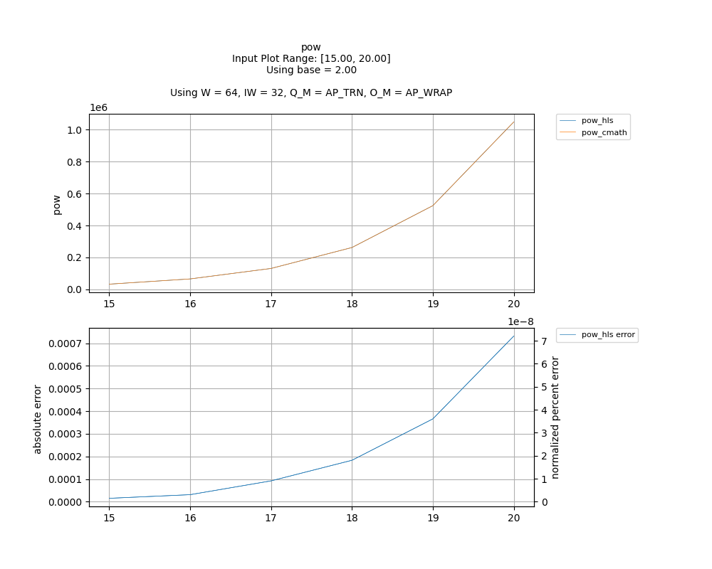
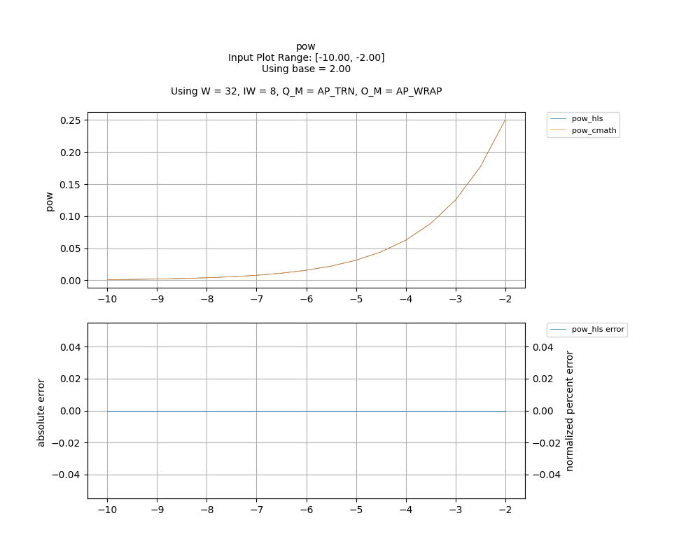
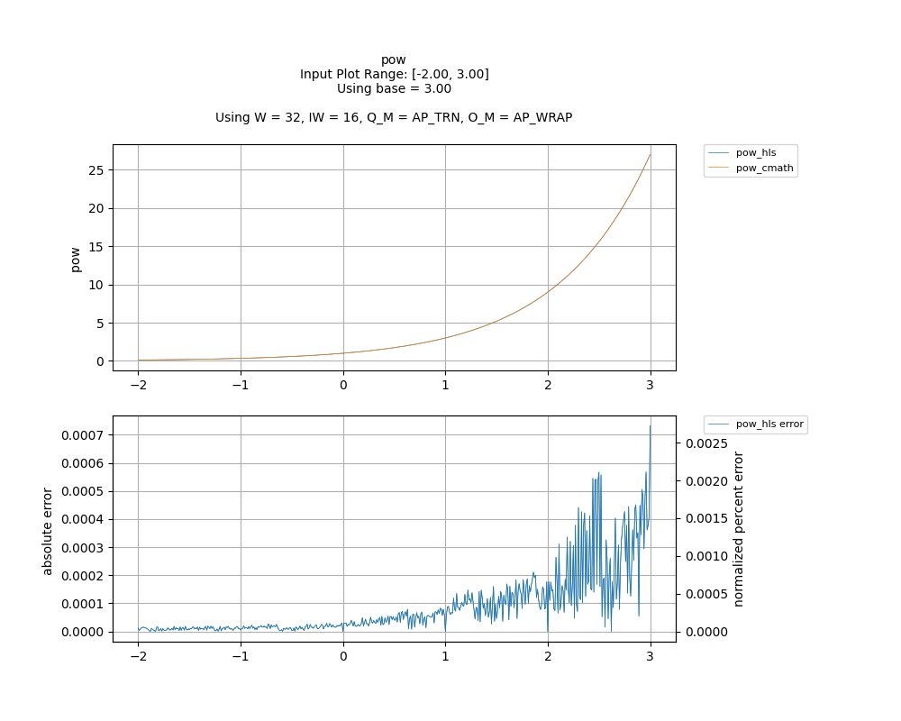
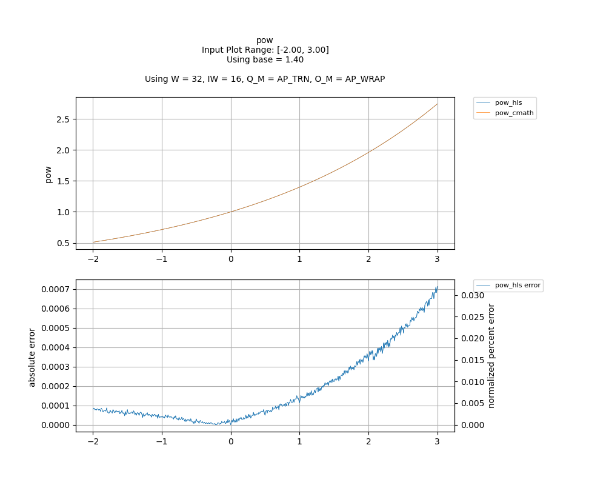
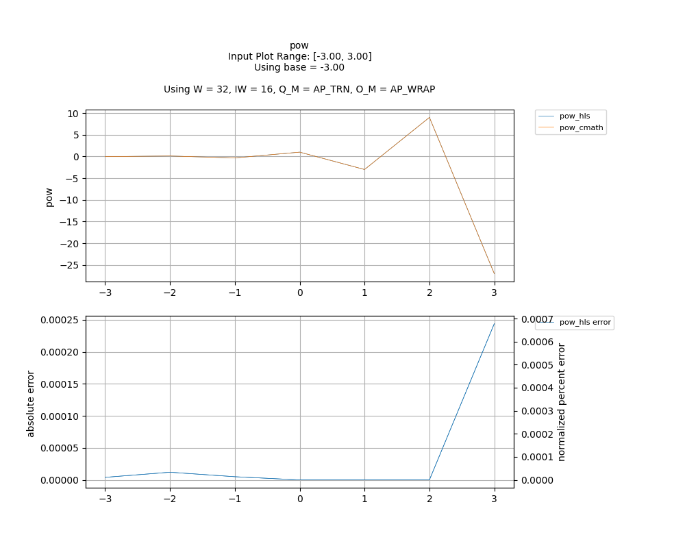

## [`pow`](../../include/hls_pow.hpp)

## Table of Contents:

**Functions**

> [`pow`](#function-pow)

**Examples**

> [Examples](#examples)

**Quality of Results**

> [Error Graph](#error-graph)

> [Resource Usage](#resource-usage)

### Function `pow`
~~~lua
template <unsigned int W_OUT, int IW_OUT, unsigned int W_IN, int IW_IN>
ap_fixpt<W_OUT, IW_OUT> pow(ap_fixpt<W_IN, IW_IN> base, ap_fixpt<W_IN, IW_IN> pow, int error)
~~~

Implementation of pow using ln_taylor and exp.

**Template Parameters:**

- `unsigned int W_OUT`: width of the output
- `int IW_OUT`: width of integer portion of the output
- `unsigned int W_IN`: width of the input (automatically inferred)
- `int IW_IN`: width of integer portion of the input (automatically inferred)

**Function Arguments:**

- `ap_fixpt<W_IN, IW_IN> base`: base number
- `ap_fixpt<W_IN, IW_IN> pow`: power to raise the base to
- `int error`: variable to hold error code if error encountered

**Returns:**

- `ap_fixpt<W_OUT, IW_OUT>`: base number raised to the power of pow
## Examples

~~~lua
  hls::ap_fixpt<10, 2> y = 2;

  hls::ap_fixpt<10, 3> base = 2;

  auto x = hls::math::pow<10, 2>(base, y); //x will be an ap_fixpt w/ the value 4

~~~

The example used to gather the following graph and resource report can be found [here](../../examples/simple/pow).

## Error Graph

## Resource Usage

Using MPF300

Input Plot Range: [15.00, 20.00]
Using base = 2.00
Using W = 64, IW = 32, Q_M = AP_TRN, O_M = AP_WRAP

| Name      | Latency [cycles] (min/max/avg)   | II [cycles] (min/max/avg)   |   Avg Error |   Max Error |   LUTs |   DFFs |   DSPs |   LSRAM |   uSRAM | Estimated Frequency   |
|-----------|----------------------------------|-----------------------------|-------------|-------------|--------|--------|--------|---------|---------|-----------------------|
| pow_cmath | 474 / 474 / 474.00               | 43 / 43 / 43.00             |    0        |    0        |  19994 |  29731 |      9 |       8 |       0 | 383.142 MHz           |
| pow_hls   | 292 / 293 / 292.17               | 1 / 2 / 1.20                |    0.000237 |    0.000732 |  31736 |  43041 |    215 |      26 |     154 | 383.142 MHz           |

Input Plot Range: [-10.00, -2.00]
Using base = 2.00
Using W = 32, IW = 8, Q_M = AP_TRN, O_M = AP_WRAP

| Name      | Latency [cycles] (min/max/avg)   | II [cycles] (min/max/avg)   |   Avg Error |   Max Error |   LUTs |   DFFs |   DSPs |   LSRAM |   uSRAM | Estimated Frequency   |
|-----------|----------------------------------|-----------------------------|-------------|-------------|--------|--------|--------|---------|---------|-----------------------|
| pow_cmath | 474 / 474 / 474.00               | 43 / 43 / 43.00             |           0 |           0 |  19994 |  29731 |      9 |       8 |       0 | 383.142 MHz           |
| pow_hls   | 178 / 179 / 178.06               | 1 / 2 / 1.06                |           0 |           0 |  11360 |  15891 |     89 |      11 |      60 | 383.142 MHz           |

Input Plot Range: [-2.00, 3.00]
Using base = 3.00
Using W = 32, IW = 16, Q_M = AP_TRN, O_M = AP_WRAP

| Name      | Latency [cycles] (min/max/avg)   | II [cycles] (min/max/avg)   |   Avg Error |   Max Error |   LUTs |   DFFs |   DSPs |   LSRAM |   uSRAM | Estimated Frequency   |
|-----------|----------------------------------|-----------------------------|-------------|-------------|--------|--------|--------|---------|---------|-----------------------|
| pow_cmath | 474 / 474 / 474.00               | 43 / 43 / 43.00             |     0       |    0        |  19994 |  29731 |      9 |       8 |       0 | 383.142 MHz           |
| pow_hls   | 170 / 171 / 170.00               | 1 / 2 / 1.00                |     8.7e-05 |    0.000732 |   8577 |  12772 |     65 |       8 |      32 | 383.142 MHz           |

Input Plot Range: [-2.00, 3.00]
Using base = 1.40
Using W = 32, IW = 16, Q_M = AP_TRN, O_M = AP_WRAP

| Name      | Latency [cycles] (min/max/avg)   | II [cycles] (min/max/avg)   |   Avg Error |   Max Error |   LUTs |   DFFs |   DSPs |   LSRAM |   uSRAM | Estimated Frequency   |
|-----------|----------------------------------|-----------------------------|-------------|-------------|--------|--------|--------|---------|---------|-----------------------|
| pow_cmath | 474 / 474 / 474.00               | 43 / 43 / 43.00             |    0        |    0        |  19994 |  29731 |      9 |       8 |       0 | 383.142 MHz           |
| pow_hls   | 170 / 171 / 170.00               | 1 / 2 / 1.00                |    0.000179 |    0.000714 |   8577 |  12772 |     65 |       8 |      32 | 383.142 MHz           |

Input Plot Range: [-3.00, 3.00]
Using base = -3.00
Using W = 32, IW = 16, Q_M = AP_TRN, O_M = AP_WRAP

| Name      | Latency [cycles] (min/max/avg)   | II [cycles] (min/max/avg)   |   Avg Error |   Max Error |   LUTs |   DFFs |   DSPs |   LSRAM |   uSRAM | Estimated Frequency   |
|-----------|----------------------------------|-----------------------------|-------------|-------------|--------|--------|--------|---------|---------|-----------------------|
| pow_cmath | 474 / 474 / 474.00               | 43 / 43 / 43.00             |     0       |    0        |  19994 |  29731 |      9 |       8 |       0 | 383.142 MHz           |
| pow_hls   | 170 / 171 / 170.00               | 1 / 2 / 1.00                |     3.8e-05 |    0.000244 |   8577 |  12772 |     65 |       8 |      32 | 383.142 MHz           |

Notes:
- The standard C math library uses floating point numbers.
- FMax is displayed as reported after RTL synthesis and may change during place and route.
- Targeted FMax was 400MHz.

Back to [top](#).