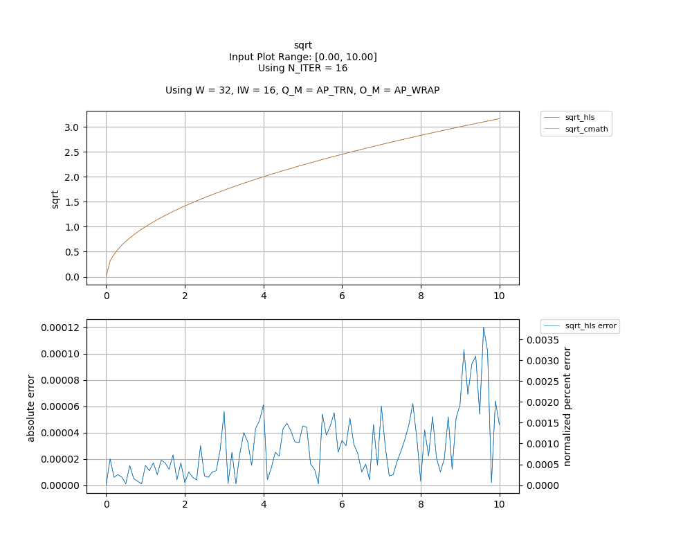

## [`sqrt`](../../include/hls_sqrt.hpp)

## Table of Contents:

**Functions**

> [`sqrt`](#function-sqrt)

**Examples**

> [Examples](#examples)

**Quality of Results**

> [Error Graph](#error-graph)

> [Resource Usage](#resource-usage)

### Function `sqrt`
~~~lua
template <unsigned int W_OUT, int IW_OUT, int N_ITERATIONS, unsigned int W_IN, int IW_IN>
ap_fixpt<unsigned int W_OUT, int IW_OUT> sqrt(ap_fixpt<unsigned int W_IN, int IW_IN> num)
~~~

Iterative implementation of sqrt.Takes in x as a fixed point number, returns sqrt(x).

**Template Parameters:**

- `unsigned int W_OUT`: width of the output
- `int IW_OUT`: width of integer portion of the output
- `int N_ITERATIONS`: number of iterations
- `unsigned int W_IN`: width of the input (automatically inferred)
- `int IW_IN`: width of integer portion of the input (automatically inferred)

**Function Arguments:**

- `ap_fixpt<unsigned int W_IN, int IW_IN> num`: input

**Returns:**

- `ap_fixpt<unsigned int W_OUT, int IW_OUT>`: square root of input value 
## Examples

~~~lua
  hls::ap_fixpt<10, 2> y = 4;

  auto x = hls::math::sqrt<10, 2, 20>(y); //x will be an ap_fixpt w/ the value 2

~~~

The example used to gather the following graph and resource report can be found [here](../../examples/simple/sqrt).

## Error Graph

## Resource Usage

Using MPF300

Input Plot Range: [0.00, 1.00]
Using N_ITER = 16
Using W = 32, IW = 8, Q_M = AP_TRN, O_M = AP_WRAP

| Name       | Latency [cycles] (min/max/avg)   | II [cycles] (min/max/avg)   |   Avg Error |   Max Error |   LUTs |   DFFs |   DSPs |   LSRAM |   uSRAM | Estimated Frequency   |
|------------|----------------------------------|-----------------------------|-------------|-------------|--------|--------|--------|---------|---------|-----------------------|
| sqrt_cmath | 6 / 262 / 218.28                 | 6 / 262 / 218.48            |       0     |     0       |  12584 |  16173 |      6 |       0 |       0 | 280.584 MHz           |
| sqrt_hls   | 84 / 85 / 84.01                  | 1 / 2 / 1.01                |       7e-06 |     1.5e-05 |   2690 |   4649 |      0 |       0 |       7 | 419.992 MHz           |

Input Plot Range: [1.00, 100.00]
Using N_ITER = 16
Using W = 32, IW = 16, Q_M = AP_TRN, O_M = AP_WRAP

| Name       | Latency [cycles] (min/max/avg)   | II [cycles] (min/max/avg)   |   Avg Error |   Max Error |   LUTs |   DFFs |   DSPs |   LSRAM |   uSRAM | Estimated Frequency   |
|------------|----------------------------------|-----------------------------|-------------|-------------|--------|--------|--------|---------|---------|-----------------------|
| sqrt_cmath | 6 / 262 / 218.28                 | 6 / 262 / 218.48            |     0       |    0        |  12584 |  16173 |      6 |       0 |       0 | 280.584 MHz           |
| sqrt_hls   | 102 / 103 / 102.01               | 1 / 2 / 1.01                |     9.9e-05 |    0.000244 |   3542 |   6298 |      0 |       0 |       6 | 430.663 MHz           |

Input Plot Range: [0.00, 4294967295.00]
Using N_ITER = 30
Using W = 33, IW = 32, Q_M = AP_TRN, O_M = AP_WRAP

| Name       | Latency [cycles] (min/max/avg)   | II [cycles] (min/max/avg)   |   Avg Error |   Max Error |   LUTs |   DFFs |   DSPs |   LSRAM |   uSRAM | Estimated Frequency   |
|------------|----------------------------------|-----------------------------|-------------|-------------|--------|--------|--------|---------|---------|-----------------------|
| sqrt_cmath | 6 / 262 / 218.28                 | 6 / 262 / 218.48            |    0        |    0        |  12584 |  16173 |      6 |       0 |       0 | 280.584 MHz           |
| sqrt_hls   | 185 / 186 / 185.20               | 1 / 2 / 1.25                |    0.052281 |    0.159138 |   8763 |  22283 |      0 |       1 |      26 | 338.409 MHz           |

Input Plot Range: [0.00, 10.00]
Using N_ITER = 16
Using W = 32, IW = 16, Q_M = AP_TRN, O_M = AP_WRAP

| Name       | Latency [cycles] (min/max/avg)   | II [cycles] (min/max/avg)   |   Avg Error |   Max Error |   LUTs |   DFFs |   DSPs |   LSRAM |   uSRAM | Estimated Frequency   |
|------------|----------------------------------|-----------------------------|-------------|-------------|--------|--------|--------|---------|---------|-----------------------|
| sqrt_cmath | 6 / 262 / 218.28                 | 6 / 262 / 218.48            |     0       |     0       |  12584 |  16173 |      6 |       0 |       0 | 280.584 MHz           |
| sqrt_hls   | 102 / 103 / 102.01               | 1 / 2 / 1.01                |     2.9e-05 |     0.00012 |   3542 |   6298 |      0 |       0 |       6 | 430.663 MHz           |

Notes:
- The standard C math library uses floating point numbers.
- Targeted FMax was 400MHz.

Back to [top](#).