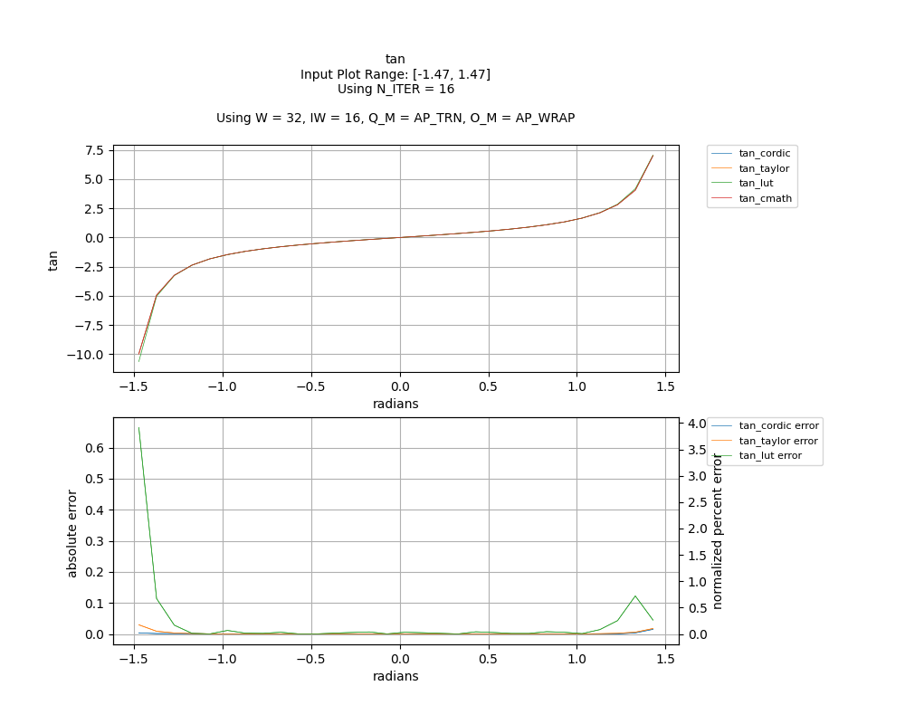

## [`tan`](../../include/hls_tan.hpp)

## Table of Contents:

**Functions**

> [`tan_cordic`](#function-tan_cordic)

> [`tan_taylor`](#function-tan_taylor)

> [`tan_lut`](#function-tan_lut)

**Examples**

> [Examples](#examples)

**Quality of Results**

> [Error Graph](#error-graph)

> [Resource Usage](#resource-usage)

### Function `tan_cordic`
~~~lua
template <unsigned int W_OUT, int IW_OUT, int N_ITERATIONS, unsigned int W_IN, int IW_IN>
ap_fixpt<unsigned int W_OUT, int IW_OUT> tan_cordic(ap_fixpt<unsigned int W_IN, int IW_IN> x, int error)
~~~

CORDIC implementation of tan. Uses sin_cordic and cos_cordic.

**Template Parameters:**

- `unsigned int W_OUT`: width of the output
- `int IW_OUT`: width of integer portion of the output
- `int N_ITERATIONS`: number of CORDIC iterations
- `unsigned int W_IN`: width of the input (automatically inferred)
- `int IW_IN`: width of integer portion of the input (automatically inferred)

**Function Arguments:**

- `ap_fixpt<unsigned int W_IN, int IW_IN> x`: angle (in radians)
- `int error`: variable to hold error code value if an error occurs

**Returns:**

- `ap_fixpt<unsigned int W_OUT, int IW_OUT>`: tangent of input angle
### Function `tan_taylor`
~~~lua
template <unsigned int W_OUT, int IW_OUT, unsigned int W_IN, int IW_IN>
ap_fixpt<unsigned int W_OUT, int IW_OUT> tan_taylor(ap_fixpt<unsigned int W_IN, int IW_IN> x, int error)
~~~

2-term Taylor Series implementation of tan based off sin_taylor and cos_taylor.

**Template Parameters:**

- `unsigned int W_OUT`: width of the output
- `int IW_OUT`: width of integer portion of the output
- `unsigned int W_IN`: width of the input (automatically inferred)
- `int IW_IN`: width of integer portion of the input (automatically inferred)

**Function Arguments:**

- `ap_fixpt<unsigned int W_IN, int IW_IN> x`: angle (in radians)
- `int error`: variable to hold error code value if an error occurs

**Returns:**

- `ap_fixpt<unsigned int W_OUT, int IW_OUT>`: tangent of input angle
### Function `tan_lut`
~~~lua
template <unsigned int W_OUT, int IW_OUT, unsigned int W_IN, int IW_IN>
ap_fixpt<unsigned int W_OUT, int IW_OUT> tan_lut(ap_fixpt<unsigned int W_IN, int IW_IN> x)
~~~

Lookup Table implementation of tan based on sin_lut and cos_lut.Number of decimal bits of input value is recommended to be less than DECIM (defined in utils/generators/generated_tables/sin_lut_table.hpp)See utils/generators/sin_lut_gentable.cpp to generate your own tables.

**Template Parameters:**

- `unsigned int W_OUT`: width of the output
- `int IW_OUT`: width of integer portion of the output
- `unsigned int W_IN`: width of the input (automatically inferred)
- `int IW_IN`: width of integer portion of the input (automatically inferred)

**Function Arguments:**

- `ap_fixpt<unsigned int W_IN, int IW_IN> x`: angle (in radians)

**Returns:**

- `ap_fixpt<unsigned int W_OUT, int IW_OUT>`: tangent of input angle
## Examples

~~~lua
  hls::ap_fixpt<10, 2> y = 3.1415;

  auto x = hls::math::tan_cordic<10, 2, 16>(y); //x will be an ap_fixpt w/ the value 0

~~~
~~~lua
  hls::ap_fixpt<10, 2> y = 3.1415;

  auto x = hls::math::tan_taylor<10, 2>(y); //x will be an ap_fixpt w/ the value 0

~~~
~~~lua
  hls::ap_fixpt<10, 2> y = 3.1415;

  auto x = hls::math::tan_lut<10, 2>(y); //x will be an ap_fixpt w/ the value 0

~~~

The example used to gather the following graph and resource report can be found [here](../../examples/simple/tan).

## Error Graph

## Resource Usage

Using MPF300

Input Plot Range: [-1.47, 1.47]
Using N_ITER = 16
Using W = 32, IW = 16, Q_M = AP_TRN, O_M = AP_WRAP

| Name       | Latency [cycles] (min/max/avg)   | II [cycles] (min/max/avg)   |   Avg Error |   Max Error |   LUTs |   DFFs |   DSPs |   LSRAM |   uSRAM | Estimated Frequency   |
|------------|----------------------------------|-----------------------------|-------------|-------------|--------|--------|--------|---------|---------|-----------------------|
| tan_cmath  | 218 / 483 / 340.05               | 218 / 483 / 338.59          |    0        |    0        |  38550 |  44728 |     29 |       5 |      21 | 335.796 MHz           |
| tan_cordic | 87 / 88 / 87.02                  | 1 / 2 / 1.02                |    0.001054 |    0.015253 |   9899 |  12570 |      3 |       1 |       0 | 335.796 MHz           |
| tan_taylor | 100 / 101 / 100.02               | 1 / 2 / 1.02                |    0.002537 |    0.029693 |  14109 |  20652 |     67 |       1 |       0 | 335.796 MHz           |
| tan_lut    | 93 / 94 / 93.02                  | 1 / 2 / 1.02                |    0.037227 |    0.664322 |  11620 |  15949 |     30 |       1 |       0 | 335.796 MHz           |

Notes:
- The standard C math library uses floating point numbers.
- FMax is displayed as reported after RTL synthesis and may change during place and route.
- Targeted FMax was 400MHz.

Back to [top](#).