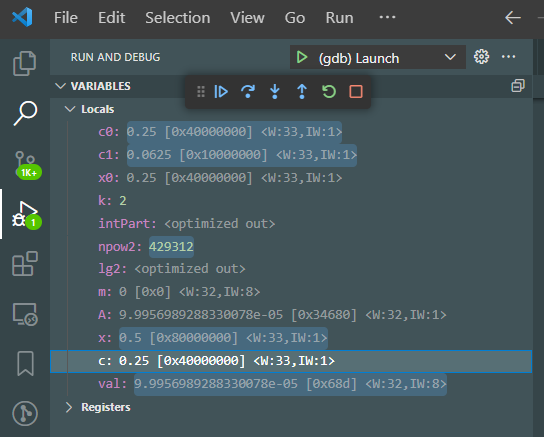

# SmartHLS GDB ap_fixpt pretty-printer

The SmartHLS Fixed Point Math Library includes a gdb pretty-printer that 
simplifies the debugging of applications that use ap_fixpt datatypes. 

##  From the command line

At the gdb prompt, simply source the file as follows:
```
(gdb) source <PATH_TO_LIB>/math/utils/gdb-pretty-printers/ap_fixed.py
```

`<PATH_TO_LIB>` represents the path to where the library has been cloned or the 
default path (snapshot) included in the SmartHLS installation directory 
(`SMARTHLS_ROOT_DIR/smarthls-library/external`).

To avoid having to do this every time `gdb` is executed, the source command can
be added to the `.gdbinit` file:

```
$> cat $HOME/.gdbinit
source <PATH_TO_LIB>/math/utils/gdb-pretty-printers/ap_fixed.py
```

After that you can visualize any ap_[u]fixpt variable using the print (p) command. 
The pretty-printer will display the Real value, the hexadecimal representation, 
the word width (W) and the width of the integer part (IW):

```
(gdb) print x
$2 = 0.49999999906867743 [0xfffffff8] <W:34,IW:1> 
```

The pretty-printer can be disabled by typing this:
```
disable pretty-printer global hls_lookup_type
```

Without the pretty printer, the same variable would be printed like this:
```
(gdb) print x
$3 = {<hls::ap_num<34u>> = {static width = <optimized out>, static sw_word_w = 64, static num_chars = <optimized out>, data_ = {static WIDTH = <optimized out>, static SW_WORD_W = 64, static NUM_WORDS = 1, static BIT_OFF = <optimized out>, static MSW_MASK = <optimized out>, static MSB_MASK = <optimized out>, words_ = {4294967288}}}, static F_W = <optimized out>, 
  static _W = <optimized out>, static _I_W = <optimized out>, static _Q_M = <optimized out>, static _O_M = <optimized out>, static sS = <optimized out>, static TYPE = <optimized out>}
```

## Using Visual Studio Code gdb extension

The `launch.vscode.example.json` file is an example/template that can be used to
enable the VSCode gdb extension to also use the SmartHLS ap_fixpt pretty-printer.
It would look like this:



*NOTE:* the `launch.vscode.example.json` file has a `<PROGRAM_NAME>` string that 
has to be replaced with the name of your program that is meant to be debugged. 