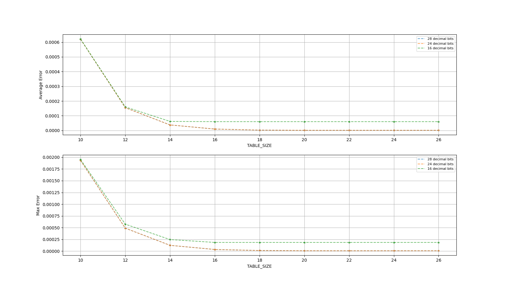
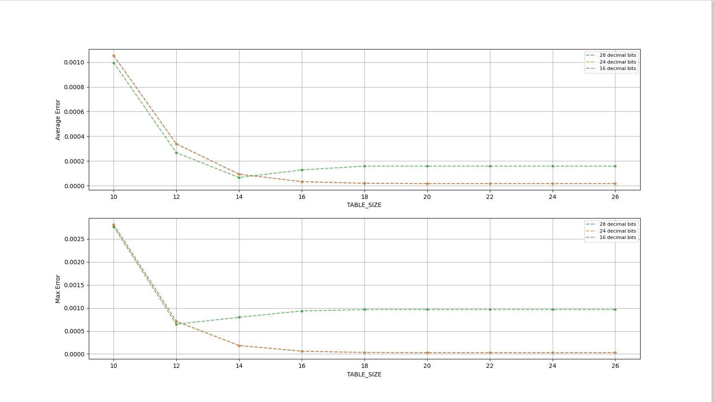
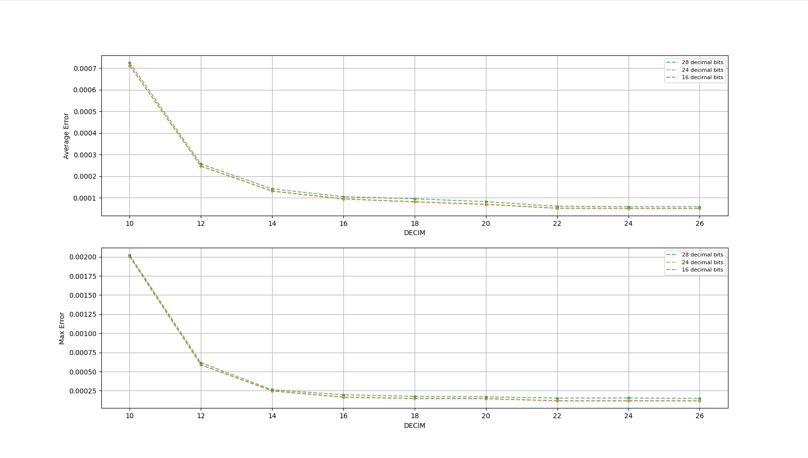

# Lookup Tables in the Math Library


## TL;DR
- Default tables included in [generated_tables](generated_tables) are pre-generated and work for most use cases. 
- Change these tables only if necessary, like if you need ultra high precision, or if the resource usage too high but you can deal with low precision.) Note changing the tables will overwrite the defaults.
- The table resolution is independent of library functions' fixpt input/output template parameters.


## Introduction
Some [implementations](#what-tables-are-there) of functions in the math library require lookup tables, such as [sin](../../include/hls_sin.hpp) and [log2](../../include/hls_log2.hpp).
The subdirectory [generated_tables](generated_tables/) contains the tables that are used by these functions, while this folder contains table generators.
The tables in the generated_tables directory have been pre-generated for your convenience, and the functions that use these tables can be run with the pre-generated tables
with little error. 

Though not recommended, if needed, you can generate your own tables by running the table generators. This will overwrite the pre-generated tables. It's highly recommended you read the section in this document on the table you are trying to generate, but you can skip to [here](#how-to-run) for instructions on how to generate the table you want to generate.


## What Tables Are There?
- [cordic_angle_gentable.cpp](cordic_angle_gentable.cpp) creates [cordic_angle_table.hpp](generated_tables/cordic_angle_table.hpp), which is included in [hls_cordic.hpp](../../include/hls_cordic.hpp), and used by [hls_sin.hpp](../../include/hls_sin.hpp), [hls_asin.hpp](../../include/hls_asin.hpp), [hls_cos.hpp](../../include/hls_cos.hpp), [hls_acos.hpp](../../include/hls_acos.hpp), [hls_sincos.hpp](../../include/hls_sincos.hpp), and [hls_tan.hpp](../../include/hls_tan.hpp). See [CORDIC](#cordic).
- [cordic_hyperbolic_gentable.cpp](cordic_hyperbolic_gentable.cpp) creates [cordic_angle_hyp_table.hpp](generated_tables/cordic_angle_hyp_table.hpp), which is included in [hls_cordic.hpp](../../include/hls_cordic.hpp), and used by [hls_log2.hpp](../../include/hls_log2.hpp), [hls_ln.hpp](../../include/hls_ln.hpp), and [hls_exp.hpp](../../include/hls_exp.hpp). See [CORDIC](#cordic).
- [log_gentable.cpp](log_gentable.cpp) creates [log_table.hpp](generated_tables/log_table.hpp), which is included in [hls_log2.hpp](../../include/hls_log2.hpp), and used by [hls_log2.hpp](../../include/hls_log2.hpp), [hls_ln.hpp](../../include/hls_ln.hpp), [hls_pow.hpp](../../include/hls_pow.hpp), and [hls_log.hpp](../../include/hls_llog.hpp). See [log](#log).
- [sin_lut_gentable.cpp](sin_lut_gentable.cpp) creates [sin_lut_table.hpp](generated_tables/sin_lut_table.hpp), which is included in [hls_sin.hpp](../../include/hls_sin.hpp), and used by [hls_sin.hpp](../../include/hls_sin.hpp), [hls_cos.hpp](../../include/hls_cos.hpp), and [hls_tan.hpp](../../include/hls_tan.hpp). See [sin_lut](#sin_lut).


## Notes on Creating Tables
While increasing the table size will likely decrease error, it will also increase resource usage. In the CORDIC and log tables, table size is determined by the `TABLE_SIZE` constant (see more about CORDIC [here](#cordic), and log [here](#log).) In the sin_lut table, table size is detemined by the `DECIM` constant (see more [here](#sin_lut).)

### CORDIC 
These tables store the CORDIC angles for a [circular coordinate system](generated_tables/cordic_angle_table.hpp) and a [hyperbolic coordinate system](cordic_hyperbolic_gentable.cpp) .

**Configurable Constants**
- `TABLE_SIZE`: depth of the table to be generated
- `W_OUT`: width of the fixpt values in the table
- `IW_OUT`: how far the MSB is above the decimal in the fixpt values in the table

By default, `TABLE_SIZE` is set to 16 since any number larger seemed to present diminishing returns with regards to error. To help you visualize error as a function of table depth, see the graph below.


### log
This [table](generated_tables/log_table.hpp) stores the values of log base 2 of 1 + (1 << n) for values of n from 0 to `TABLE_SIZE`.

**Configurable Constants**
- `TABLE_SIZE`: depth of the table to be generated
- `W_OUT`: width of the fixpt values in the table
- `IW_OUT`: how far the MSB is above the decimal in the fixpt values in the table

By default, `TABLE_SIZE` is set to 16 since any number larger seemed to present diminishing returns with regards to error. To help you visualize error as a function of table depth, see the graph below.




### sin_lut
In brief, every combination of bits representable by `DECIM` + 1 bits corresponds to a sin value in this [table](generated_tables/sin_lut_table.hpp). The size of the fixpt input argument to the `sin_lut` function (i.e. `W_IN` and `IW_IN`) is recommended to be exactly equal to `DECIM` (though the function will still work if it's over or under `DECIM`.) For an explanation, see the end of this section.

**Configurable Constants**
- `DECIM`: the number of bits dedicated to representing decimals while creating the table. Also determines the size of the table
- `W_OUT`: width of the fixpt values in the table
- `IW_OUT`: how far the MSB is above the decimal in the fixpt values in the table

By default, `DECIM` is set to 15, since any number larger seemed to present diminishing returns with regards to error.
To help you visualize error as a function of table depth, see the graph below.



The value bitwidth of `W_OUT` = 20 was chosen such that it fits each element into one row (check term?) of 1 LSRAM. Any larger would result in using more DFFs & LUTs to store the table. 

The basic idea of the sin lookup table is to look up (hah) the values of `sin(x)` for any given x in a pre-computed table, saving time and resources on computation. 
Unoptimized, this table will take up lots of memory, so the next section is dedicated to explaining how we lower the amount of memory while explaining what customization you can do
to the table.

Due to the periodic nature of sin, we only need to store the `sin(x)` value for values of x between 0 and PI/2. To compute `sin(x)` for values outside this range, we find sin of the
prinicpal angle and perform rotations to find sin of the desired angle.

To make the table as accurate as possible, every combo representable by `T_W` = `DECIM` + 1 bits needs to correspond to a sin value in the lookup table. However, if we stored all
these values in just one table, the size of this table would balloon exponentially! So instead, we exploit the trignometric identity `sin(a) * cos(b) + cos(a) * sin(b) = sin(a + b)`.
and split `T_W` in two, using 4 tables:`sin_fa` and `cos_fa` (tables for the bits comprising the top half of `T_W`), and `sin_fb` and `cos_fb` (tables for the bits comprising the bottom half of `T_W`).

For example, say `DECIM` = 8, so `T_W` = 9.
```
 _._ _ _ _ _ _ _ _ <= We have 9 Input Bits, so a total of 2^9 possible inputs (each bit is a possible 0/1.)

  |         |         Instead of storing the sin of every combo of 2^T_W bits, we cut the Input Bits into two halves, such that we have a 
  v         v         fa section of the Input Bits, and a fb section.
 _._ _ _ _ _ _ _ _ 
|______| |_______|
 fa = 4   fb = 5
``` 
 
However, because the range of the input is only from 0 to PI/2, fa's tables don't need to represent the entire width of bits that's been alotted.
In fact, they only need to store up to PI/2 div by 2 + 1 values.

For the previous example: 
```
PI/2 is represented using T_W bits as 110010010 (where fa = 1100, fb = 10100)
Number of fa table entries = (110010010 / 2) + 1 = 1100 + 1 = 1101 (13)
Number of fb table entries = 1 << 5 = 100000 (32)
```

Such that the tables look like:
```
sin_fa = {sin(0000 00000), sin(0001 00000), sin(0010 00000), ... sin(1101 00000)}
cos_fa = {cos(0000 00000), cos(0001 00000), cos(0010 00000), ... cos(1101 00000)}
sin_fb = {sin(00000), sin(00001), sin(00010), ... sin(11111)}
cos_fb = {cos(00000), cos(00001), cos(00010), ... cos(11111)}
```
That all to say: the larger `DECIM` gets, the more accurate the table will be, but will require more memory to store. Making the number of bits representing the decimal of the input of sin_lut equal to `DECIM` is optimal. If it is smaller than `DECIM`, then memory will be wasted storing more in the tables than necessary. If it is larger than `DECIM`, then the input will be truncated to have `DECIM` decimal bits, and input precision will be lost, likely resulting in a less precise result. 


### How to Run
1. Before compiling your design, enter the utils/generators directory.
2. Open the file of the generator you want to run, and adjust the constants to match your requirements.
3. Close the file, and run `make gen_*_table`, where * is a stand-in for the type of table you want to make. Options include gen_log_table, gen_cordic_table, gen_cordic_hyp_table, gen_sin_lut, or gen_all_tables.
4. The new table will be created in the `generated_tables` directory.
5. You can now compile and run your design.


