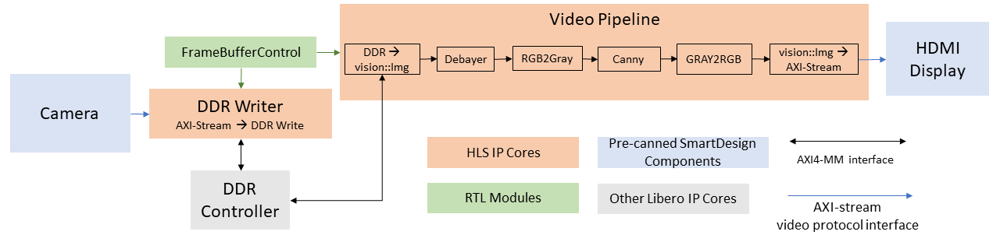
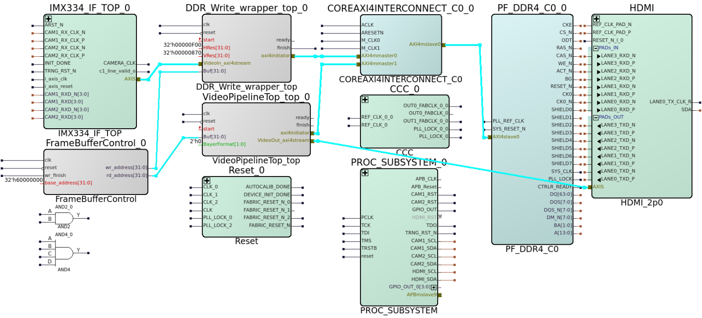

<!-- TOC -->

- [PolarFire Video Kit Demo Design](#polarfire-video-kit-demo-design)
    - [Overview](#overview)
    - [HLS Project](#hls-project)
        - [C++ Source Code](#c-source-code)
        - [Running SmartHLS to generate HLS IP cores](#running-smarthls-to-generate-hls-ip-cores)
    - [Running Libero to generate the complete demo design](#running-libero-to-generate-the-complete-demo-design)

<!-- /TOC -->
# PolarFire Video Kit Demo Design
## Overview

To showcase the capabilities of the Vision library, we provide this reference demo design targeting the [PolarFire Video Kit](https://www.microchip.com/en-us/development-tool/MPF300-VIDEO-KIT-NS) board.
The board carries a MPF300T PolarFire FPGA with 300K logic elements (LE) and has a dual camera sensor plus three HDMI transmitter/receiver ports.
This demo design will make use of one camera and a HDMI transmitter port for displaying output on a connected monitor.


The reference design uses the HLS C++ library functions and the provided RTL components to form a complete video pipeline from camera to display, processing 4K resolution video at 30 FPS.



The diagram above illustrates the main components of the design,
- The design starts with using the [Camera SmartDesign (SD) component](../../rtl/camera_sd_component/IMX334_IF_TOP/IMX334_IF_TOP_recursive.tcl) to acquire camera frames in Bayer format.
  The Camera SD component is provided as part of the library. The component outputs the camera's Bayer format frame in [AXI-stream Video Protocol](../../include/interface/README.md#axi4-stream-video-protocol).
  The AXI-Stream video protocol embeds the start-of-frame and the end-of-line signals as part of the data stream, and supports back-pressure and data bubble, permitting easier integration between the camera, display and processing cores.

- The next block in the pipeline is the `DDR writer` module which receives frame data in AXI-Stream video format and writes the data to DDR via an AXI-initiator (M) interface (write channels only: AW, W, and B). This module is an HLS core generated using the Vision library's [`AxisVideo2AxiMM`](../../include/interface/README.md#axisvideo2aximm) conversion function (`AxiMM` here means AXI Memory Map, and represents a DDR region of memory).

- The entire `Video Pipeline` is a single HLS IP core.
  - The pipeline reads the frame data from DDR using the Vision library's [`AxiMM2Img()`](../../include/interface/README.md#aximm2img) conversion function, and is connected to DDR using an AXI-initiator (M) interface (read channels only: AR and R).
    - As you can see, the camera data is not passed directly to the `Video Pipeline` and display, but is instead first buffered in DDR.
    This is because of the mismatched frame rates between the camera and display module.
    By buffering the data in DDR, our `DDR writer` and `Video Pipeline` will automatically adapt to the frame rates of upstream (camera) and downstream (video pipeline and display) respectively and create a stable data flow.
    The "automatic rate adaption" is implicitly done by using the AXI interface's ready-valid handshaking for data transfer,
    e.g., the `DDR writer` writes to DDR when camera has "valid" data, and the `Video Pipeline` reads data from DDR only when it is "ready".
  - In `Video Pipeline`, we first do `Debayer` processing, converting Bayer format frames into RGB format suitable for display. 
  - Then, we do `Canny` edge detection by converting the RGB data to Gray Scale and feeding the resulting data to the `Canny` function. The data output by `Canny` is  a Gray Scale image, which is then converted  to RGB format (although visually the image is still in Gray Scale, the conversion makes it possible to display the data on the RGB display).
  - **Note** that the image processing functions in the HLS C++ library all operate on the [`vision::Img`](../../include/common/README.md#img-class) data type that permits more interface configurations (e.g., AXI4 Initiator, AXI4 Target, Memory interface) and buffering options between processing modules.
  - At the end of the `Video Pipeline`, we use the Vision library's [`Img2AxisVideo`](../../include/interface/README.md#img2axisvideo) function to convert between `vision::Img` data type and AXI-Stream video Protocol.

  

- The design also instantiates a [FrameBufferControl](libero/src/hdl/ddr_access_wrapper.v#L136) module.
  - The `FrameBufferControl` module provides the base addresses in DDR for `DDR writer` and `Video Pipeline` to access.
  - Each time the `DDR writer` finishes writing a frame to DDR, `FrameBufferControl` provides a new address for the `DDR writer` to write the next frame;
    and provides to the `Video Pipeline` with the address of latest frame (the frame that just got written to DDR by `DDR writer`).
  - In this design, `FrameBufferControl` is parameterized to use 4 frame buffers with each frame buffer taking 8 MB of space.
  - The purpose of the `FrameBufferControl` is to make sure the `DDR writer` and `Video Pipeline` do not simultaneously access the same frame buffer in DDR.
    If `DDR writer` and `Video Pipeline` are writing and reading the same frame buffer at the same time, the `Video Pipeline` can read a "broken" frame that contains pixels from different frames (because a new frame is being written while read is happening).
    The `FrameBufferControl` module always provides distinct buffer addresses to the `DDR writer` and Video Pipeline.
    The buffer address update mechanism also allows to better adapt the mismatched frame rates from the write and read side.
    - If the reader (Video Pipeline) has a higher frame rate than the writer, the `FrameBufferControl` will not always provide a new buffer address for the reader between consecutive frames,
      because a new address is only provided to the reader when the writer finishes writing a frame.
      So the reader may read the same frame buffer back-to-back, but it is guaranteed that the frame is not "broken".
    - If the writer has a higher frame rate, since `FrameBufferControl` always updates the read buffer address to the latest written frame, the reader can catch up the write side by reading the latest written frame, and skip older frames.
      As long as the write side is no more than 2X faster than the read side, 4 frame buffers can guarantee that the read and write sides never access the same frame.
      - Say `Video Pipeline` starts reading Frame Buffer 1 **right before** the writer finishes writing Frame Buffer 2 (reader always reads the latest written frame).
        In order for the writer to overwrite Frame Buffer 1 while `Video Pipeline` is still reading it (which can cause "broken" frame), the writer will need to finish writing to Frame Buffer 3 & 4 before `Video Pipeline` finishes reading Frame Buffer 1.
        Essentially the writer needs to write 2 frames before the `Video Pipeline` finishes reading 1 frame in order for the "broken" frame to occur.


- Lastly, the resulting stream is forwarded to the [Display SD component](../../rtl/display_sd_component/HDMI_2p0/HDMI_2p0_recursive.tcl) to be displayed using HDMI.

The following sections will take a closer look at the HLS cores and the complete Libero project integrating all parts together,
and walk through the steps from compiling the HLS designs to generating the bitstream that can be programmed onto the FPGA board.

## HLS Project

The [hls](./hls/) subdirectory contains the SmartHLS project implementing the two HLS IP cores in the above diagram: `DDR writer` and `Video Pipeline`.

### C++ Source Code

All HLS IP cores (top-level functions) and testbenches are specified in the [pf_demo.cpp](./hls/pf_demo.cpp) file,
- Near the top of the files, there are five `using` statements defining the data types used in the design:
  - For example, the `using BayerAxisVideoT = vision::AxisVideoFIFO<HLS_8UC1, NPPC_4>` statement defines the data type corresponding to the [AXI-stream Video Protocol](../../include/interface/README.md#axi4-stream-video-protocol) interface,
    used for the input to `DDR writer`.
    The template parameter `HLS_8UC1` describes the Bayer format pixel type, 1 channel of 8bit unsigned value.
    The next template parameter `NPPC_4` means four pixels-per-clock-cycle, i.e., every four pixels are packed as one word in the AXI-stream.
    The pipeline needs to process four pixels per clock cycle while running at 148.5 clock frequency, in order to meet the desired data rate of 4K resolution at 30 FPS.
  - The `RgbAxisVideoT` corresponds to the output AXI-stream from `Video Pipeline` going into HDMI Display. The pixel type has 3 RGB channels, each with a 8bit unsigned value.
  - The `BayerImgT`, `RgbImgT`, and`GrayImgT` are the [`vision::Img`](../../include/common/README.md#img-class) class types internal to the Video Pipeline, corresponding to the inputs and outputs of the `Video Pipeline` functions.
- There are two top-level functions annotated with `#pragma HLS function top`: `DDR_write_wrapper` and `VideoPipelineTop`. They are the two HLS IP cores in the above diagram.
  - In top-level functions, the line `#pragma HLS interface argument(Buf) type(axi_initiator) num_elements(AXI_WORDS_PER_FRAME) max_burst_len(256)`
    informs SmartHLS to implement the `Buf` argument as an [AXI4 Initiator](https://onlinedocs.microchip.com/oxy/GUID-AFCB5DCC-964F-4BE7-AA46-C756FA87ED7B-en-US-11/GUID-93A05651-C06B-4805-94D3-0443DC0FED4E.html?hl=axi4%2Cinitiator%2Cinterface) interface.
  - In the `VideoPipelineTop` function, a [`dataflow`](https://onlinedocs.microchip.com/oxy/GUID-AFCB5DCC-964F-4BE7-AA46-C756FA87ED7B-en-US-11/GUID-24B4CBDB-506F-433E-95F9-28FA2811E9CF.html) pragma is used
    to specify that the six sub-functions, `AxiMM2Img`, `DeBayer`, `RGB2GRAY`, `Canny`, `GRAY2RGB`, and `Img2AxisVideo` can run in parallel to process the continuous stream of pixel data.
- The next section of the code is the `main()` function implementing a software testbench to verify the top-level functions.
  - There are three main steps in the software testbench:
    1) Prepare the input test vector for the top-level functions,
    2) Run the top-level functions with the test vector and obtain the output,
    3) Then verify the output by comparing against an expected output.
  - While the testbench code and comments should be self-explanatory, it is worth mentioning our library's [OpenCV utilities](../../include/common/README.md#OpenCV-utilities):
    - The `convertToCvMat` function converts our `vision::Img` type to OpenCV's `cv::Mat` type.
      And our library also has a `convertFromCvMat` function that does the opposite.
    - The `compareMat` function is useful for comparing `cv::Mat` with a given tolerance and reports the error percentage.

### Running SmartHLS to generate HLS IP cores

Now it is time to use SmartHLS to compile the C++ functions to hardware in Verilog RTL.
Make sure you have the repository setup according to this [Setup](../../README.md#Setup) guide.
We will use SmartHLS' [Command Line Interface](https://onlinedocs.microchip.com/oxy/GUID-AFCB5DCC-964F-4BE7-AA46-C756FA87ED7B-en-US-11/GUID-9355FB9A-5134-49FB-8F37-525A043B736E.html).
All commands below are to be run under the `hls` directory.

The first step will be to verify the software implementation is functionally correct, by compiling and running the software on your development machine (e.g., X86):

```console
> shls sw    # Enter 'Y' if got prompt about needing to first compile the software.
```

We expect to see the following messages from the software run:
```
Pass
```

After confirming the software is working correctly, we can compile the C++ functions to RTL by running
```console
> shls hw
```

Then we can run SmartHLS' [Software/Hardware CoSimulation](https://onlinedocs.microchip.com/oxy/GUID-AFCB5DCC-964F-4BE7-AA46-C756FA87ED7B-en-US-11/GUID-1E5B6475-7959-41AD-A3B0-0F4629416576.html)
to verify the generated RTL has the equivalent functionality as the software.
```console
> shls cosim
```
We expect to see the following messages:
```
Pass
Number of calls: 1
Cycle latency: 2,085,372
SW/HW co-simulation: PASS
```
The reported cycle latency corresponds to the longest running top-level functions.
Both top-level functions have similar cycle latency, which can be approximated as the number of pixels per frame divided by 4 pixels-per-clock-cycle, i.e., 3840 * 2160 / 4 = 2,073,600.
As a sanity check, this approximated cycle latency (minimum number of cycles) is fairly close to the reported cycle latency from simulation.

## Running Libero to generate the complete demo design

With the HLS IP cores generated, we can now create a Libero project and integrate the HLS IP cores and Camera and Display components,
along with additional IPs such as AXI interconnect, DDR controller and clock generator IPs.

To facilitate generating the demo design and running it on board, we provide a package of TCL scripts that create the project,
integrate the components in SmartDesign to form the complete design,
then synthesize, place-and-route the design, and finally generate a job file that can be programmed on board.

You can execute the TCL scripts from Libero IDE as well as from command line.

`Note: This demo is designed to work on the latest Libero version, 2023.2, and may not be compatible with previous versions of Libero`

Here are the steps to run the TCL scripts from the Libero IDE,
- First launch Libero IDE (On Windows, please launch IDE from SmartHLS' Cygwin terminal as following),
  ```console
  > cd ./libero
  > rm -rf vision_pipeline  # Delete the folder in case you have run this step before.
  > libero &
  ```
- Once the IDE is launched, navigate to the top-level menu bar, select "Project" > "Execute Script...".
  Then click the `...` button and select the `libero_flow.tcl` under the libero folder.
- Hit "Run" then you should see the IDE executing the TCL scripts with the following main steps,
  - Create a number of hierarchical SmartDesign components and connect the components together.
    The result of this step is a top-level SmartDesign component called "VIDEO_KIT_TOP" that stiches together sub-components like, HDMI, Camera (IMX334_IF_TOP_0), HLS video pipeline (VideoPipelineTop) and etc.
  - Then Libero proceeds to run RTL synthesis, place-and-route and export the bitstream for programming the PolarFire Video Kit FPGA device.

To run the TCL scripts from command line, you can run the following command in the [`libero`](./libero/) folder,
```console
> cd ./libero
> rm -rf vision_pipeline  # Delete the folder in case you have run this step before.
> libero SCRIPT:libero_flow.tcl 2>&1 | tee output.log
```

Once the above step is done, a job file will be generated inside the
[`libero`](./libero/) folder, which you can use to program and deploy the design
on board.

The image below shows the top-level SmartDesign inside Libero:


