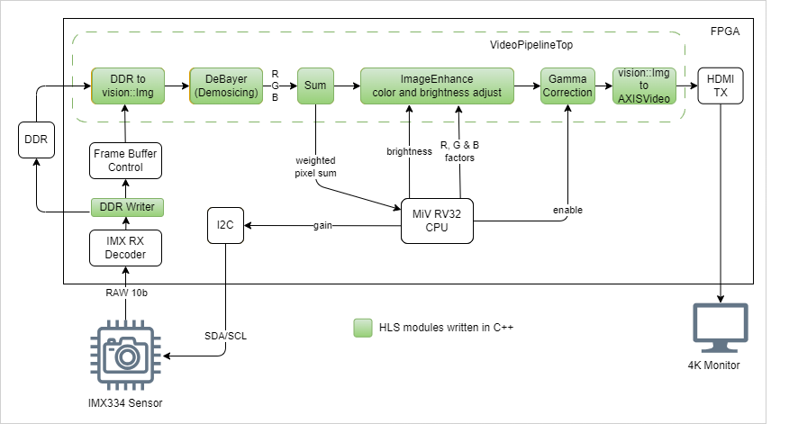

# PolarFire Video Kit Automatic Gain Control, Color Enhancement and Gamma Correction

## Overview


This design illustration showcases the application of the SmartHLS vision library 
in constructing a 4K video processing pipeline featuring automatic gain control, 
enhanced color contrast, and brightness optimization. The video frames are captured 
using the IMX334 camera sensor integrated within the PolarFire Video Kit board 
and are subsequently outputted to an HDMI monitor. The accompanying diagram 
highlights in green the modules developed in C++ and compiled using SmartHLS.



The MiV RV32 CPU reads the sum of all pixels for a given frame, computes the
average by diving the sum by number of pixels, and based on that the camera sensor
gain is adjusted via I2C.  The CPU can also set the brightness, three factors
to adjust red, blue and green channels, and finally it can also enable or disable 
the gama correction processing.

## Sum() function

This module computes the weighted sum of the channels, similar to how it is done
in gray scale conversion, however, the module does not modify the original frame
data. The calculation is a simple approximation of the NTSC luminance formula to save 
some resources:

- Original: 
$Y  = 0.299 * R + 0.587 * G + 0.114 * B$
- Approx:
$Y  = 0.25 * R + 0.5 * G + 0.125 * B$
- Multiply by two: $2Y = 0.5 * R + G + 0.25 * B$

Once the sum is computed for the entire frame it can be used to compute the 
average intensity of the frame. The average is computed by the CPU and divide by 
2 to eliminate the extra 2 factor.

## ImageEnhance() function

This module will perform the following transformation to the video frame:

- $r\_out = brightness + (r\_const / 32) * r\_channel$
- $g\_out = brightness + (g\_const / 32) * g\_channel$
- $b\_out = brightness + (b\_const / 32) * b\_channel$


The multiplying factors (`r_const, g_const, b_const`) are 8-bit unsigned integers,
and are set by the MiV RV32 CPU using the SmartHLS autogenerated C++ API inside
the `vision/demo_designs/pfvk_agc_color_brightness/sw/main.cpp` function.  
The division by 32 is to allow the effective factor to be less than 1 (const < 32), 
exactly 1 (const=32), or more than one (const>32).

## GamaCorrection() function

A camera sensor provides a proportional linear relationship between light 
intensity and the digital value. However, a human eye perceives the images 
as a logarithmic function of intensity instead of a linear function. 
To compensate for this pixels can go through a gamma correction process by
using the following equation:

$PixelOut = pow(PixelIn, (1/GammaFactor))$

The GammaCorrection function is implemented using a fixed look-up table for exponent 
function. The width of the input data determines the number of entries in the 
table. For example, 8-bit input data would require 2^8 (256) entries. 

Currently, the table is pre-computed to a gamma factor of 0.5. The table is
defined in: `vision/utils/generators/generated_tables/gamma_correction_table.hpp`,
which is an autogenerated file. The table can be regenerated to use a different
gamma factor. For example:

1. Modify the gamma factor in the `fpga-hls-libraries/vision/utils/generators/gen_gamma_correction_table.cpp` 
file and save it.
```
// Change these parameters as needed:
//--\/--------------------------------\/--
#define CHANNEL_WIDTH 8
#define GAMMA 0.5
//--/\--------------------------------/\--
```
2. Then generate the table:
```
cd fpga-hls-libraries/vision/utils/generators
make gen_gamma_correction_table
```
After the table is generated, the `GammaCorrection` module can be compiled by
SmartHLS. 

**NOTEs**: 
- This is a temporary solution to generate a table at compile-time, which 
is not possible to do in SmartHLS 2024.1. However, this will be fixed in a future
release of SmartHLS and the table would be automatically generated at compile-time.

- The GammaCorrection function can be enabled or disabled by the MiV RV32 CPU 
  using the SmartHLS autogenerate C++ API. 

## Other functions

For a description of the `DDR Writer`, `FrameBuffer`, `DeBayer`, `AxiMM2Img` and  
`ImgToAxisVideo` functions please see the other PolarFire Video Kit demo 
.


## Compiling the design


#### Compile the SmartHLS module

```bash
cd hls 
shls hw 
```

#### Compile the Libero project

To compile the libero project it is recommended to clean the previous implementation.
The `libero_flow.tcl` script will include the previously compiled SmartHLS module. 

```bash
cd libero
rm -rf component vision_pipeline
libero SCRIPT:libero_flow.tcl logfile:libero.log
```

After Libero finished generating the bitstream (`./libero/VIDEO_KIT_TOP.job` file)
the FPGA can be programmed with it using FlashProExpress.

#### UART stdout

The design includes a MiV RV32 CPU to initialize the camera and provide the
Automatic Gain Control loop.  To confirm the CPU is running open the UART port
using your preferred serial terminal application. Note the device can be different
in your system, for example:

```bash
tio -b 115200 /dev/ttyUSB0
```

If the CPU is running the terminal should contain messages like these:

```bash
avg:43, gain:150
avg:42, gain:150
```

This is informing the average pixel value and the gain applied back to the 
IMX334 camera sensor. This will change depending on the light condition around 
the board.

## Compile the RV32 MiV software

The design includes a precompiled software binary file (vision/demo_designs/pfvk_agc_color_brightness/libero/src/cfg_and_mem_files/imx334_4lane_raw10_1188Mbps_AE.hex) that gets included in the
bitstream and performs the automatic gain control and some initial settings for
brightness, color adjustment and gamma correction.

However, the code for the CPU can be modified, and then compiled with the following 
command:

```
cd vision/demo_designs/pfvk_agc_color_brightness/sw
make
```

This will create a `sw/build` directory with all the .o, .el and .hex files. Then
to load the .elf binary into the CPU's memory and execute it:

First start OpenOCD:
```
openocd -f board/microsemi-riscv.cfg
```

Then start the RISC-V gdb and run the gdb.txt script:
```
riscv64-unknown-elf-gdb ./build/main.elf  -x gdb.txt
```

## Know issue:

Currently, there's a known issue where the code in the RV32 CPU will not start
running after the bitstream is programmed. There are two options:

1. Power-cycle the board after programming the bitstream, or
2. Use gdb and openocd to initialize the processor

