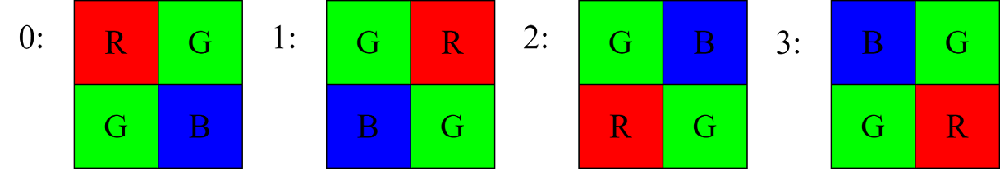
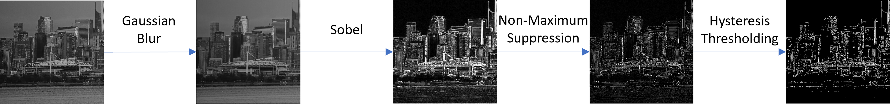
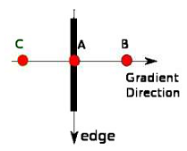

<!-- TOC -->

- [Color conversion (format\_conversions.hpp)](#color-conversion-format_conversionshpp)
  - [RGB \<--\> Grayscale](#rgb----grayscale)
    - [`RGB2GRAY()`](#rgb2gray)
    - [`GRAY2RGB()`](#gray2rgb)
  - [Bayer \<--\> RGB](#bayer----rgb)
    - [`DeBayer()`](#debayer)
    - [`RGB2Bayer()`](#rgb2bayer)
- [Canny and related blocks](#canny-and-related-blocks)
  - [Canny (canny.hpp)](#canny-cannyhpp)
  - [Gaussian Blur (gaussian\_blur.hpp)](#gaussian-blur-gaussian_blurhpp)
  - [Sobel](#sobel)
    - [`Sobel(InImg, OutImg)` (sobel.hpp)](#sobelinimg-outimg-sobelhpp)
    - [Sobel(InImg, OutImg, OutDirection) (sobel\_direction.hpp)](#sobelinimg-outimg-outdirection-sobel_directionhpp)
  - [Non-Maximum Suppression (nonmaximum\_suppression.hpp)](#non-maximum-suppression-nonmaximum_suppressionhpp)
  - [Hysteresis Thresholding (hysteresis.hpp)](#hysteresis-thresholding-hysteresishpp)
- [Gamma Correction (gamma\_correction.hpp)](#gamma-correction-gamma_correctionhpp)
- [Convolution\_2D (convolution\_2d.hpp)](#convolution_2d-convolution_2dhpp)
- [ImageEnhance (image\_enhance.hpp)](#imageenhance-image_enhancehpp)
- [Histogram Equalization (equalized\_histogram.hpp)](#histogram-equalization-equalized_histogramhpp)
- [Crop Image (crop\_image.hpp)](#cropimage-crop_imagehpp)
- [BilinearFilter (bilinear\_filter.hpp)](#bilinearfilter-bilinear_filterhpp)

<!-- /TOC -->

# Color conversion ([format_conversions.hpp](format_conversions.hpp))

## RGB <--> Grayscale

### `RGB2GRAY()`
```cpp
template <
  bool NTSC = true, 
  PixelType PIXEL_T_IN, 
  PixelType PIXEL_T_OUT,
  unsigned H, 
  unsigned W, 
  StorageType STORAGE_IN = FIFO,
  StorageType STORAGE_OUT = FIFO, 
  NumPixelsPerCycle NPPC = NPPC_1
> 
void RGB2GRAY(
  vision::Img<PIXEL_T_IN, H, W, STORAGE_IN, NPPC> &InImg,
  vision::Img<PIXEL_T_OUT, H, W, STORAGE_OUT, NPPC> &OutImg
);
```
This functions converts an input three-channel RGB `InImg` to an output single-channel grayscale `OutImg`.

**Template parameters:**
- `NTSC`: whether to use the [NTSC](https://en.wikipedia.org/wiki/NTSC) formula or not (the default value is `true`).
  - If `NTSC` is `true`: $$(0.299 * R + 0.587 * G + 0.114 * B)$$
  - If `NTSC` is `false`: $$(R + G + B) / 3$$
- The other template parameters are automatically inferred from the input and output `Img` arguments.

**Example usages:**
```cpp
Img<vision::PixelType::HLS_8UC3, ...> InImg;
Img<vision::PixelType::HLS_8UC1, ...> OutImg1, OutImg2, OutImg3;
vision::RGB2GRAY(InImg, OutImg1); // By default, use the NTSC formula.
vision::RGB2GRAY<true>(InImg, OutImg2); // Explicitly use the NTSC formula.
vision::RGB2GRAY<false>(InImg, OutImg3); // Explicitly do not use the NTSC formula.
```

### `GRAY2RGB()`
```cpp
template <
  PixelType PIXEL_T_IN, 
  PixelType PIXEL_T_OUT, 
  unsigned H, 
  unsigned W,
  StorageType STORAGE_IN = FIFO, 
  StorageType STORAGE_OUT = FIFO,
  NumPixelsPerCycle NPPC = NPPC_1
> 
void GRAY2RGB(
  vision::Img<PIXEL_T_IN, H, W, STORAGE_IN, NPPC> &InImg,
  vision::Img<PIXEL_T_OUT, H, W, STORAGE_OUT, NPPC> &OutImg
);
```
This function takes in an input single-channel grayscale `InImg`.
The resulting output `OutImg` is still visually the same grayscale image but represented in RGB format.
In other words, for each pixel in `OutImg`, the `R`, `G`, and `B` channels all have the same value as the original grayscale value.

**Template parameters:**
- All template parameters are automatically inferred from the input and output `Img` arguments.

**Example usages:**
```cpp
Img<vision::PixelType::HLS_8UC1, ...> InImg;
Img<vision::PixelType::HLS_8UC3, ...> OutImg;
vision::GRAY2RGB(InImg, OutImg);
```

## Bayer <--> RGB
### `DeBayer()`
```cpp
template <
  PixelType PIXEL_T_IN, 
  PixelType PIXEL_T_OUT,
  unsigned H, 
  unsigned W,
  StorageType STORAGE_IN,
  StorageType STORAGE_OUT, 
  NumPixelsPerCycle NPPC = NPPC_1
> 
void DeBayer(
  vision::Img<PIXEL_T_IN, H, W, STORAGE_IN, NPPC> &InImg,
  vision::Img<PIXEL_T_OUT, H, W, STORAGE_OUT, NPPC> &OutImg,
  ap_uint<2> BayerFormat = 0
);
```
This function converts image data in Bayer format to RGB format. Bayer format is
widely used in cameras (like the IMX 334 used in the [PolarFire Video Kit demo](../../demo_designs/PF_Video_kit/))
where there is only 1 channel of data and each pixel can represent either red, green, or blue.
To find equivalent of a pixel in RGB format, we interpolate the neighboring pixels
and use the same formulas as in the [bayer interpolation IP core](https://www.microchip.com/en-us/products/fpgas-and-plds/ip-core-tools/bayer-interpolation) to find the value for red, green, and blue channels. Each bayer
image follows one of the RGGB, GRBG, GBRG, BGGR formats, which indicate how the
first 2 pixels in top 2 lines of the image look, and affect the interpolation algorithm.
These are the `BayerFormat` values this function supports:
* 0: RGGB
* 1: GRBG
* 2: GBRG
* 3: BGGR


The image below shows how the first pixels look in each bayer format:


### `RGB2Bayer()`
```cpp
template <
  PixelType PIXEL_T_IN, 
  PixelType PIXEL_T_OUT, 
  unsigned H, 
  unsigned W,
  StorageType STORAGE_IN = FIFO, 
  StorageType STORAGE_OUT = FIFO,
  NumPixelsPerCycle NPPC = NPPC_1
>
void RGB2Bayer(
  vision::Img<PIXEL_T_IN, H, W, STORAGE_IN, NPPC> &InImg,
  vision::Img<PIXEL_T_OUT, H, W, STORAGE_OUT, NPPC> &OutImg
);
```
This function converts an image in RGB format to RGGB (`BayerFormat` 0 in DeBayer) bayer format.
RGB2Bayer can be useful for simulating incoming camera data in your code, and can be compiled to hardware.

(For a full example SmartHLS design using DeBayer and RGB2Bayer, please see: [examples/debayer](../../examples/debayer/debayer.cpp).)


# Canny and related blocks
Canny Edge Detection is a popular edge detection algorithm. It consists of four stages, whose visual effect on the image is as followed:
- `Gaussian Blur`: reduce the noise in the image by blurring it.
- `Sobel`: find the intensity gradient of the image to identify the edges.
- `Non-Maximum Suppression`: make the edges thinner.
- `Hysteresis Thresholding`: sharpen the image by suppressing weak edges and strengthening strong edges.

The figure below shows the visual effect of each stage:



For a reference documentation done by OpenCV on the Canny algorithm, please see https://docs.opencv.org/4.5.4/da/d22/tutorial_py_canny.html.

The following section will explain in more details the underlying algorithms of Canny and its four component blocks, as implemented by the Vision library.


## Canny ([canny.hpp](canny.hpp))
```cpp
template <
  unsigned GAUSSIAN_SIZE = 5, 
  unsigned SOBEL_SIZE = 3,
  vision::PixelType PIXEL_T_IN, 
  vision::PixelType PIXEL_T_OUT,
  unsigned H, 
  unsigned W, 
  StorageType STORAGE_IN = StorageType::FIFO,
  StorageType STORAGE_OUT = StorageType::FIFO,
  NumPixelsPerCycle NPPC = NPPC_1
>
void Canny (
  Img<PIXEL_T_IN, H, W, STORAGE_IN, NPPC> &InImg,
  Img<PIXEL_T_OUT, H, W, STORAGE_OUT, NPPC> &OutImg, unsigned Thres
);
```
This function finds edges in an image using the [Canny Edge Detection Algorithm](https://en.wikipedia.org/wiki/Canny_edge_detector).

This function calls four sub-functions that carry out the four stages of the Canny algorithm, using SmartHLS' [Data Flow Parallelism](https://onlinedocs.microchip.com/oxy/GUID-AFCB5DCC-964F-4BE7-AA46-C756FA87ED7B-en-US-11/GUID-24B4CBDB-506F-433E-95F9-28FA2811E9CF.html):
- [`GaussianBlur()`](#gaussian-blur-gaussian_blurhpp)
- [`Sobel()`](#sobel-filter)
- [`NonMaximumSuppression()`](#non-maximum-suppression-nonmaximum_suppressionhpp)
- [`Hysteresis()`](#hysteresis-thresholding-hysteresishpp)

**Arguments:**
- `InImg`: The input image to the function. It has to be single-channel (e.g. grayscale).
- `OutImg`: The output image. It is a single-channel image, where the edge pixels are colored white (pixel value 255), and the non-edge background pixels are colored black (pixel value 0).
- `Thres`: The threshold pixel value used in [Hysteresis Thresholding](#hysteresis-thresholding-hysteresishpp).

**Template parameters:**
- `GAUSSIAN_SIZE`: The size of the Gaussian Filter used in [`GaussianBlur()`](#gaussian-blur-gaussian_blurhpp).
  - Currently only supports a value of `5`.
- `SOBEL_SIZE`: The size of the Sobel Filter used in [`Sobel()`](#sobel).
  - Currently only supports a value of `3`.
- The other template parameters are automatically inferred from the input and output `Img` arguments.

**Limitations:**
- Only support single-channel images.
- Assume that the pixel value is from 0 to 255.
  In reality, if the pixel type is something other than `HLS_8UC`, this assumption will not be true.
- Only support `GAUSSIAN_SIZE` of 5.
- Only support `SOBEL_SIZE` of 3.
- Only support single-threshold for [Hysteresis Thresholding](#hysteresis-thresholding-hysteresishpp).


## Gaussian Blur ([gaussian_blur.hpp](gaussian_blur.hpp))
```cpp
template <
  unsigned FILTER_SIZE = 5, 
  PixelType PIXEL_T_IN, 
  PixelType PIXEL_T_OUT,
  unsigned H, 
  unsigned W, 
  StorageType STORAGE_IN = StorageType::FIFO,
  StorageType STORAGE_OUT = StorageType::FIFO,
  NumPixelsPerCycle NPPC = NPPC_1
>
void GaussianBlur(
  vision::Img<PIXEL_T_IN, H, W, STORAGE_IN, NPPC> &InImg,
  vision::Img<PIXEL_T_OUT, H, W, STORAGE_OUT, NPPC> &OutImg
);
```
This functions blurs an image using a Gaussian filter. The output `OutImg` is the result of the convolution between the input `InImg` and the Gaussian filter.

If the Gaussian filter has a size of 5:

$$
OutImg = \frac{1}{256} \left[\begin{array}{cc}
1 &  4 &  6 &  4 & 1\\
4 & 16 & 24 & 16 & 4\\
6 & 24 & 36 & 24 & 6\\
4 & 16 & 24 & 16 & 4\\
1 &  4 &  6 &  4 & 1\\
\end{array}\right] * InImg
$$

**Arguments:**
- `InImg`: The input image to the function. It has to be single-channel (e.g. grayscale).
- `OutImg`: The output image after blurring. It is a single-channel image.

**Template parameters:**
- `FILTER_SIZE`: The size of the Gaussian filter.
  - Currently only supports a value of `5`.
- The other template parameters are automatically inferred from the arguments `InImg` and `OutImg`.

**Limitations:**
- Only support single-channel images.
- Assume that the pixel value is from 0 to 255.
  In reality, if the pixel type is something other than `HLS_8UC`, this assumption will not be true.
- Only support `FILTER_SIZE` of `5`.

## Sobel
### `Sobel(InImg, OutImg)` ([sobel.hpp](sobel.hpp))
```cpp
template <
  unsigned FILTER_SIZE = 3, 
  PixelType PIXEL_T_IN, 
  PixelType PIXEL_T_OUT,
  unsigned H, 
  unsigned W, 
  StorageType STORAGE_IN = StorageType::FIFO,
  StorageType STORAGE_OUT = StorageType::FIFO,
  NumPixelsPerCycle NPPC = NPPC_1
>
void Sobel(
  vision::Img<PIXEL_T_IN, H, W, STORAGE_IN, NPPC> &InImg,
  vision::Img<PIXEL_T_OUT, H, W, STORAGE_OUT, NPPC> &OutImg
);
```
This function does edge detection by calculating the Sobel gradients of the input image's pixel intensity:
- At each pixel position, calculate horizontal gradient <code>G<sub>x</sub></code> and vertical gradient <code>G<sub>y</sub></code> by doing the following convolutions:

$$
Gx=\left[\begin{array}{cc}
-1 & 0 & +1\\
-2 & 0 & +2\\
-1 & 0 & +1\\
\end{array}\right] * InImg
$$

$$
Gy=\left[\begin{array}{cc}
-1 & -2 & -1\\
 0 &  0 &  0\\
+1 & +2 & +1\\
\end{array}\right] * InImg
$$

- Then, combine the magnitude of <code>G<sub>x</sub></code> and <code>G<sub>y</sub></code> to get the final output:
$$
OutImg = |Gx| + |Gy|
$$

**Arguments:**
- `InImg`: The input image to the function. It has to be single-channel (e.g. grayscale).
- `OutImg`: The output image after blurring. It is a single-channel image.

**Template parameters:**
- `FILTER_SIZE`: The size of the Sobel filter.
  - Currently only supports a value of `5`.
- The other template parameters are automatically inferred from the input and output `Img` arguments.

**Limitations:**
- Only support single-channel images.
- Assume that the pixel value is from 0 to 255.
  In reality, if the pixel type is something other than `HLS_8UC`, this assumption will not be true.
- Only support `FILTER_SIZE` of `3`.


### Sobel(InImg, OutImg, OutDirection) ([sobel_direction.hpp](sobel_direction.hpp))
```cpp
template <
  unsigned FILTER_SIZE = 3, 
  PixelType PIXEL_T_IN, 
  PixelType PIXEL_T_OUT,
  unsigned H, 
  unsigned W, 
  StorageType STORAGE_IN = StorageType::FIFO,
  StorageType STORAGE_OUT = StorageType::FIFO,
  NumPixelsPerCycle NPPC = NPPC_1
>
void Sobel(
  vision::Img<PIXEL_T_IN, H, W, STORAGE_IN, NPPC> &InImg,
  vision::Img<PIXEL_T_OUT, H, W, STORAGE_OUT, NPPC> &OutImg,
  vision::Img<PIXEL_T_OUT, H, W, STORAGE_OUT, NPPC> &OutDirection
);
```
This function behaves exactly like the [`Sobel(InImg, OutImg)`](#sobelinimg-outimg-sobelhpp) above, but also outputs an extra `Img` object `OutDirection` that represents the gradient direction at each pixel position.

This version of `Sobel()` is usually not used by itself since you do not need the gradient direction for most applications.
The main use for this function is to be run in [`canny()`](#canny-cannyhpp), where the gradient direction is a necessary input to the [Non-Maximum Suppression](#non-maximum-suppression-nonmaximum_suppressionhpp) stage to thin out the edges.

> **Explanation about the gradient direction:**
> - The gradient direction is the angle between the vertical-direction gradient <code>G<sub>y</sub></code> and the horizontal-direction gradient <code>G<sub>y</sub></code>: <code>direction = tan<sup>-1</sup>(G<sub>y</sub> / G<sub>x</sub>)</code>.
> - The gradient direction is rounded to the nearest 45 degree, to one of the four angles representing vertical, horizontal and two diagonal directions, according to the figure below.
    Note that the angle is taken from the right (0 at horizontal right) and goes counter-clockwise.
> ```
> 135     90     45
>   \     |     /
>     \   |   /
>       \ | /
> 0 ------ ------ 0
>       / | \
>     /   |   \
>   /     |     \
> 45     90     135
> ```
> - The gradient direction has the property that it is always perpendicular to edge direction.
> - In summary:
>
> | Range of the gradient angle      | Gradient Direction   | Edge direction |
> |----------------------------------|----------------------|----------------|
> | [-22.5,  22.5] or [157.5, 202.5] |   0 (horizontal)     | vertical       |
> | [ 22.5,  67.5] or [202.5, 247.5] |  45 (NW-SE diagonal) | NE-SW diagonal |
> | [ 67.5, 112.5] or [247.5, 292.5] |  90 (vertical)       | horizontal     |
> | [112.5, 157.5] or [292.5, 337.5] | 135 (NE-SW diagonal) | NW-SE diagonal |


## Non-Maximum Suppression ([nonmaximum_suppression.hpp](nonmaximum_suppression.hpp))
```cpp
template <
  PixelType PIXEL_T_IN, 
  PixelType PIXEL_T_OUT, 
  unsigned H, 
  unsigned W,
  StorageType STORAGE_IN = StorageType::FIFO,
  StorageType STORAGE_OUT = StorageType::FIFO,
  NumPixelsPerCycle NPPC = NPPC_1
>
void NonMaximumSuppression(
    vision::Img<PIXEL_T_IN, H, W, STORAGE_IN, NPPC> &InImg,
    vision::Img<PIXEL_T_IN, H, W, STORAGE_IN, NPPC> &InDirection,
    vision::Img<PIXEL_T_OUT, H, W, STORAGE_OUT, NPPC> &OutImg
);
```
This function makes the edges of the image thinner by looking at the gradient direction (which is perpendicular to the edge direction), and suppress the pixel to 0 if it is smaller than the two adjacent pixels in the gradient direction.

For example:



In the figure above, pixel A is on a vertical edge.
The gradient direction is horizontal since it is always perpendicular to the edge direction.
Pixels B and C are in the gradient direction.

Here, pixel A is checked with pixel B and C to see if it forms a local maximum. If not, then it will be suppressed to 0 (black), otherwise it is retained.

The following process is done to all pixels in the input image. The resulting output image is an image with thin edges.

**Arguments:**
- `InImg`: The input image to the function. It has to be single-channel (e.g. grayscale).
- `OutImg`: The output image after Non-Maximum Suppression. It is a single-channel image.

**Template parameters:**
- All template parameters are automatically inferred from the input and output `Img` arguments.

**Limitations:**
- Only support single-channel images.

## Hysteresis Thresholding ([hysteresis.hpp](hysteresis.hpp))
```cpp
template <
  PixelType PIXEL_T_IN, 
  PixelType PIXEL_T_OUT, 
  unsigned H, 
  unsigned W,
  StorageType STORAGE_IN = StorageType::FIFO,
  StorageType STORAGE_OUT = StorageType::FIFO,
  NumPixelsPerCycle NPPC = NPPC_1
>
void Hysteresis(
  vision::Img<PIXEL_T_IN, H, W, STORAGE_IN, NPPC> &InImg,
  vision::Img<PIXEL_T_OUT, H, W, STORAGE_OUT, NPPC> &OutImg,
  unsigned Thres
);
```
This function "sharpens" the image by suppressing weak edges and strengthening strong edges.

It compares all pixels in the input image with a threshold value `Thres`.
If the pixel is below this threshold, it is suppressed to 0 (black).
Otherwise, the pixel is strengthen to the maximum pixel value of 255 (white).

**Arguments:**
- `InImg`: The input image to the function. It has to be single-channel (e.g. grayscale).
- `OutImg`: The output image after Hysteresis Thresholding. It is a single-channel image.

**Template parameters:**
- All template parameters are automatically inferred from the input and output `Img` arguments.

**Limitations:**
- Only support single-channel images.
- Traditionally, Hysteresis Thresholding is done using double thresholds. Currently, the Vision library only supports single threshold.

# Gamma Correction ([gamma_correction.hpp](gamma_correction.hpp))
```cpp
template <
    PixelType PIXEL_T,
    unsigned H,
    unsigned W,
    StorageType STORAGE_IN,
    StorageType STORAGE_OUT,
    NumPixelsPerCycle NPPC = NPPC_1
> 
void GammaCorrection (
    vision::Img<PIXEL_T, H, W, STORAGE_IN, NPPC> &InImg,
    vision::Img<PIXEL_T, H, W, STORAGE_OUT, NPPC> &OutImg,
    const float gamma,
    const ap_uint<1> enable = 1
);
```

A camera sensor provides a proportional linear relationship between light 
intensity and the digital value. However, a human eye perceives the images 
as a logarithmic function of intensity instead of a linear function. 
To compensate for this pixels can go through a gamma correction process by
using the following equation:

$PixelOut = pow(PixelIn, (1/gamma))$

**Arguments:**
- `InImg`: The input image to the function.
- `OutImg`: The gamma-corrected output image.
- `gamma`: Constant gamma value.

**Template parameters:**
- All template parameters are automatically inferred from the input and output `Img` arguments.

**Limitations:**
- The pixel channel width must be 8 bits.
- The width of the image must be evenly divisible by the number of pixels per cycle (NPPC).
  The gamma value must be a compile-time constant, it cannot be a run-time variable. 

# Convolution_2D ([convolution_2d.hpp](convolution_2d.hpp))
```cpp
template <
  unsigned KERNEL_SIZE, 
  PixelType PIXEL_T_IN, 
  PixelType PIXEL_T_OUT,
  unsigned H, 
  unsigned W, 
  StorageType STORAGE_IN = StorageType::FIFO,
  StorageType STORAGE_OUT = StorageType::FIFO,
  NumPixelsPerCycle NPPC = NPPC_1,
  typename Func
> 
void Convolution_2d (
  vision::Img<PIXEL_T_IN, H, W, STORAGE_IN, NPPC> &InImg,
  vision::Img<PIXEL_T_OUT, H, W, STORAGE_OUT, NPPC> &OutImg,
  Func Functor
);
```
This function performs a two-dimensional convolution by sliding a kernel window
of [KERNEL_SIZE][KERNEL_SIZE] across the entire input image. The kernel must be 
known at compile time. 

For an example of how this function is used please see [gaussian_blur.hpp](gaussian_blur.hpp).

**Arguments:**
- `InImg`: The input image to the function.
- `OutImg`: The output image convolved with the kernel.
- `Functor`: A function that will be used to generate the 2D kernel at compile time. 
  The function should have the following prototype:
  ```cpp
  constexpr int Functor(int i, int j) { ... }
  ```
  This Functor will be passed the `i` and `j` arguments representing the indices 
  of the kernel window and it must return an integer value for that location. 
  
**Template parameters:**
- All template parameters are automatically inferred from the input and output arguments.

**Limitations:**
- The KERNEL_SIZE must be 3, 5 or 7.
- The kernel elements must be of type integer.
- The Functor must be relatively simple. 
- The pixel channel width must be 8 bits.
- The width of the image must be evenly divisible by the number of pixels per cycle (NPPC).
  The gamma value must be a compile-time constant, it cannot be a run-time variable. 

# ImageEnhance ([image_enhance.hpp](image_enhance.hpp))
```cpp
template <
    PixelType PIXEL_T,
    unsigned H,
    unsigned W,
    StorageType STORAGE_IN,
    StorageType STORAGE_OUT, 
    NumPixelsPerCycle NPPC = NPPC_1>
void ImageEnhance(
    vision::Img<PIXEL_T, H, W, STORAGE_IN, NPPC> &InImg,
    vision::Img<PIXEL_T, H, W, STORAGE_OUT, NPPC> &OutImg,
    ap_uint<8> b_factor,
    ap_uint<8> g_factor,
    ap_uint<8> r_factor,
    ap_int<10> brightness
);
```

This function performs the following transformation to and image:
  
- $OutImg.r = brightness + (r\_factor / 32) * InImg.r$
- $OutImg.g = brightness + (g\_factor / 32) * InImg.g$
- $OutImg.b = brightness + (b\_factor / 32) * InImg.b$
 
 The multiplying factors (`r_factor, g_factor, b_factor`) are 8-bit unsigned integers.
 The division by 32 is to allow the effective factor to be less than 1 (factor < 32), 
 exactly 1 (factor=32), or more than one (factor>32).
 
**Arguments:**
- `InImg`: The input image to the function.
- `OutImg`: The output image convolved with the kernel.
- `b_factor`: Blue multiplier
- `g_factor`: Green channel multiplier
- `r_factor`: Red channel multiplier
- `brightness`: Common offset to increase (positive) or decrease (negative) the 
  brightness (pixel value of every channel).

**Template parameters:**
- All template parameters are automatically inferred from the input and output arguments.

**Limitations:**
- Image_Enhance only supports number of pixels per cycle of 1 or 4.
- Input image must have 3 channels for R, G, B.

# BilateralFilter ([bilateral_filter.hpp](bilateral_filter.hpp))
```cpp
template <
    unsigned FILTER_SIZE, 
    PixelType PIXEL_T, 
    unsigned H, 
    unsigned W, 
    StorageType STORAGE_TYPE,
    NumPixelsPerCycle NPPC
> 
void BilateralFilter(
    Img<PIXEL_T, H, W, STORAGE_TYPE, NPPC> &InImg,
    Img<PIXEL_T, H, W, STORAGE_TYPE, NPPC> &OutImg,
    const float sigma_color,
    const float sigma_space
);
```

A bilateral filter is an edge-preserving smoothing filter used in image processing. 
It's designed to reduce noise in images while preserving important edge features. 
The key characteristics of a bilateral filter are:

- Non-linear: It considers both the spatial distance and intensity difference 
between pixels. 
- Edge-preserving: Unlike simple blurring filters, it can smooth an image while 
keeping edges sharp.
- Noise reduction: It's effective at reducing noise in images, especially Gaussian 
noise.

The bilateral filter works by replacing the intensity of each pixel with a weighted 
average of intensity values from nearby pixels. The weighting is based on two main components:

- Spatial kernel: This is similar to Gaussian blur, where closer pixels have more influence.
The `sigma_space` argument is used to compute at compile-time the space kernel.  
- Range kernel: This gives more weight to pixels with similar intensity to the target pixel.
The `sigma_color` argument is used to compute at compile-time the intensity kernel. 

By combining these two factors, the bilateral filter can smooth areas that are 
close both in terms of spatial distance and pixel intensity, while preserving 
edges where there are large intensity differences.

**Arguments:**
- `InImg`: The input image to the function.
- `OutImg`: The filtered output image.
- `sigma_color`: Constant value used to compute the color intensity kernel.
- `sigma_space`: Constant value used to compute the space kernel.

**Template parameters:**
- FILTER_SIZE: dimensions of the Gaussian kernel.  
- All other template parameters are automatically inferred from the input and output arguments.

**Limitations:**
- Only supports one-channel images (i.e. grayscale).
- FILTER_SIZE must be five.
- NPPC must be one.

# Histogram Equalization ([equalized_histogram.hpp](equalized_histogram.hpp))
```cpp
template <
    int HIST_SIZE = 256,
    PixelType PIXEL_T,
    int H,
    int W,
    StorageType STORAGE_TYPE,
    NumPixelsPerCycle NPPC
> void EqualizedHistogram (
    Img<PIXEL_T, H, W, STORAGE_TYPE, NPPC> &InImg,
    Img<PIXEL_T, H, W, STORAGE_TYPE, NPPC> &OutImg
);
```
Histogram equalization is a contrast enhancement technique used in image processing. It improves the global contrast of an image by redistributing pixel intensities so that they span the full range more evenly.

The function performs the following steps to equalize a histogram:

1. Histogram Calculation: count how many times each intensity (0–255 for 8-bit) appears in the image
2. Compute the Cumulative Distribution Function (CDF)
3. Map Old Pixel Values to New Ones: each pixel intensity is replaced with its CDF-based mapped value, which stretches out frequently occurring values and compresses less frequent ones.

The result of the processing is that darker regions become brighter and vice versa, helping details emerge.

**Arguments:**
- `InImg`: The input image to the function.
- `OutImg`: The processed output image.

**Template parameters:**
- HIST_SIZE: the size of a histogram, default to 256.
- All other template parameters are automatically inferred from the input and output arguments.

**Limitations:**
The current implementation of `hls::vision::EqualizedHistogram( )` has the following characteristics:

# CropImage ([crop_image.hpp](crop_image.hpp))
```cpp
template <
    PixelType PIXEL_T,              // Pixel Type
    int H_SRC,                      // Source Image Height
    int W_SRC,                      // Source Image Width
    int H_DST,                      // Destination Image Height
    int W_DST,                      // Destination Image Width
    StorageType STORAGE,            // Storage Type
    NumPixelsPerCycle NPPC          // Pixels Per Cycle
>
void CropImg(
    Img<PIXEL_T, H_SRC, W_SRC, STORAGE, NPPC> &InImg,
    Img<PIXEL_T, H_DST, W_DST, STORAGE, NPPC> &OutImg,
    int rowBound,
    int colBound,
    int start
);
```

This function crops an axis-aligned sub-window from a source image into a destination image.
Specifically, the function copies a rectangular Region-Of-Interest (ROI) from a streamed source image (`InImg`) into a destination image (`OutImg`). 

This function supports both FRAME_BUFFER and FIFO as the underlying image storage type.
 
**Arguments:**
- `InImg`: Source image object to crop from.
- `OutImg`: Destination image object that receives the cropped region.
- `rowBound`: Row offset of the top-left corner of the crop window in the source image.
- `colBound`: Column offset of the top-left corner of the crop window in the source image.
- `start`: Absolute offset applied to both row and column of the source image

# BilinearFilter ([bilinear_filter.hpp](bilinear_filter.hpp))
```cpp
template <
    StorageType STORAGE_TYPE,
    NumPixelsPerCycle NPPC,
    PixelType PIXEL,
    int H_DST,
    int W_DST,
    int H_SRC,
    int W_SRC
>
void BilinearFilter(
    Img<PIXEL, H_SRC, W_SRC, STORAGE_TYPE, NPPC> &InImg,
    Img<PIXEL, H_DST, W_DST, STORAGE_TYPE, NPPC> &OutImg
);
```

A bilinear filter (or bilinear interpolation) is a way to estimate the value of a
point on a regular 2D grid (e.g. an image) by taking a weighted average of its
four nearest neighbors.

A bilinear filter resizes or warps an image by treating each output pixel as a
point landing between four input pixels. It first finds that point’s surrounding
“grid square” in the source image, then blends those four corner values in two
stages—horizontally, then vertically—using weights proportional to how close the
point is to each corner. The result is a smooth, visually continuous estimate of
what the true color would be at that sub‐pixel location.

**Arguments:**
- `InImg`: The input image to the function.
- `OutImg`: The filtered output image.


**Template parameters:**
All template parameters are automatically inferred from the input and output arguments.

**Limitations:**

The current implementation has the following characteristics:

- supports only one channel
- supports only NPPC = 1
- support only 8 bits per channel
- support both FRAME_BUFFER and FIFO as the underlying image storage type
