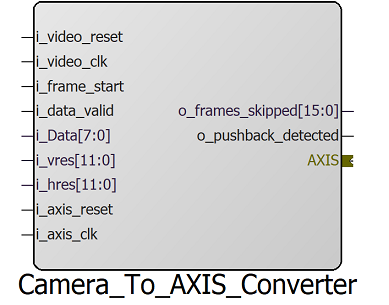
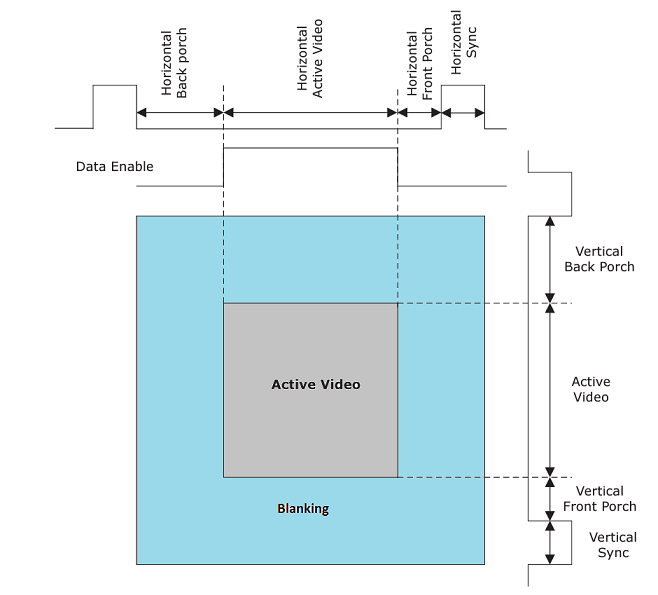
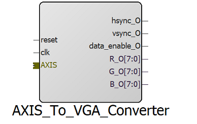
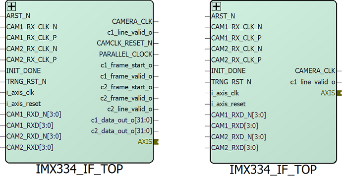
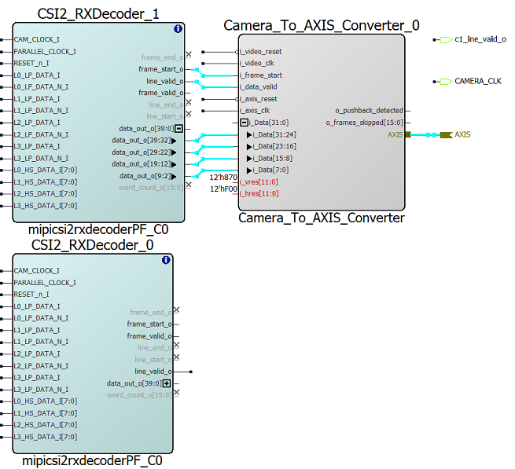
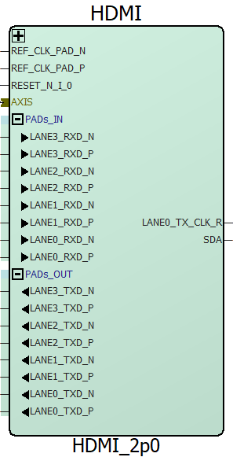
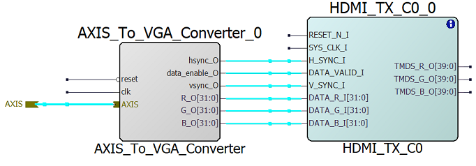
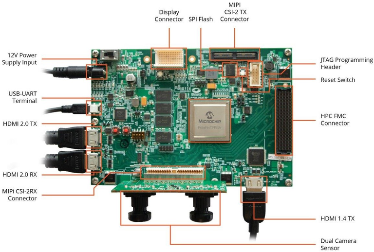

<!-- TOC -->

- [RTL modules and SmartDesign (SD) components provided in the SmartHLS Vision Library](#rtl-modules-and-smartdesign-sd-components-provided-in-the-smarthls-vision-library)
    - [Overview](#overview)
    - [Camera to AXIS-video converter](#camera-to-axis-video-converter)
    - [AXIS-Video to VGA converter](#axis-video-to-vga-converter)
    - [Camera SmartDesign component](#camera-smartdesign-component)
    - [Display SmartDesign component](#display-smartdesign-component)

<!-- /TOC -->

# RTL modules and SmartDesign (SD) components provided in the SmartHLS Vision Library
## Overview

To make it easier to adopt our [AXI4-Stream Video Protocol](../include/interface/README.md#axi4-stream-video-protocol) (AXIS-Video),
we provide RTL modules that enable the conversion of camera data to AXIS-Video, and the conversion of AXIS-Video to VGA/HDMI signals for display.
The converter modules can be used together with Libero's existing camera and display IPs to expose an AXIS-Video interface for integration.
And to further simplify the process of setting camera and display blocks on our FPGA devices,
we also provide TCL script packages to setup and create SmartDesign components for camera and HDMI.
The SmartDesign components connect to device I/O pins on one end, and expose the AXIS-Video interface for connecting to on-FPGA processing cores on the other end.

## Camera to AXIS-video converter

Camera data coming out of the [CSI2 decoder IP core](https://www.microchip.com/en-us/products/fpgas-and-plds/ip-core-tools/mipi-csi2-rx-decoder)
does not follow our AXIS-Video protocol and does not support back-pressure in the downstream module.
To make sure we have camera data coming in our standard AXIS-Video protocol and enable easy integration of camera into Vision designs,
we introduce the [Camera_to_AXIS_converter](camera_to_axis_converter/camera_to_axis_converter.v).
The camera to AXIS-Video converter connects to the CSI2 decoder IP core and outputs the data in AXIS-Video format.
- The converter has a Dual Clock (DC) FIFO to enable the camera decoder side and the AXIS-Video side to have different clock sources.
- Furthermore, the FIFO enables the converter to tolerate back-pressure from the AXIS-Video side, but only to some extents.
  That is, if the AXIS-Video side does not read frame data for prolonged period, the FIFO will eventually be filled up and cause data drop.
  The FIFO depth is configurable as specified in the table below.
- At the start of a frame, the converter checks whether the AXIS-Video side is "ready" to receive data.
  If ready, the current frame will be pushed into the FIFO for AXIS-Video side to read;
  and if not ready, the converter will drop the entire frame and skip writing pixel data into the FIFO, to avoid unnecessary FIFO overflow.
- As the camera data coming out of the CSI2 decoder IP core can have extra lines of image data at the beginning of each frame (1 line for a 4K frame),
  camera to AXIS-Video converter can drop the extra lines to have the correct number of image lines per output frame.




The tables below explain the camera to AXIS-Video converter ports and parameters:

|Parameter name |Description                            |Default value  |
|---------------|---------------------------------------|---------------|
|C_WIDTH        |Camera component (data) width          |8              |
|FIFO_DEPTH     |DC FIFO depth (must be a power of 2)   |4096           |
|PIXEL_PER_CLK  |Camera pixels per clock cycle          |1              |
|LINES_TO_SKIP  |Lines to skip at the beginning of frame|1              |


|Port name          |I/O    |Description                                            |
|-------------------|-------|-------------------------------------------------------|
|i_video_reset      |Input  |Active HIGH video (camera) reset                       |
|i_video_clock      |Input  |Video (camera) clock                                   |
|i_axis_reset       |Input  |Active HIGH AXIS reset                                 |
|i_video_clock      |Input  |AXIS clock                                             |
|i_frame_start      |Input  |Camera frame start signal                              |
|i_data_valid       |Input  |Camera data valid                                      |
|i_data             |Input  |Camera data                                            |
|i_vres             |Input  |Camera vertical resolution                             |
|i_hres             |Input  |Camera horizontal resolution                           |
|o_tvalid           |Output |AXIS valid signal                                      |
|i_tready           |Input  |AXIS ready signal                                      |
|o_tlast            |Output |AXIS last signal (End Of Line)                         |
|o_tuser            |Output |AXIS user signal (Start Of Frame)                      |
|o_tdata            |Output |AXIS data                                              |
|o_frames_skipped   |Output |Number of frames dropped due to AXIS pushback at SOF   |
|o_pushback_detected|Output |Pushback detected at AXIS SOF                          |

## AXIS-Video to VGA converter

In order to comply with the standards set by the Video and Electronics Standard Association (VESA),
it is necessary to use accurate timing signals when interfacing with display devices such as monitors.
The data being sent to the display must include gaps between lines and frames (known as blanking periods),
and it must be available at specific times.
As illustrated in the figure below, each display frame consists of an active video period and a blanking period.
At each image line, there is blanking before (horizontal back porch) and after (horizontal front porch + Hsync) the active video period.
Similarly for each video frame there are blanking lines before (vertical back porch) and after (vertical front porch + Vsync) the active video period.
During the active video period, the video data must be transmitted continuously without interruptions (or "bubbles" where no data is being transferred).
Conversely, during the blanking period, no data should be transmitted.



In order to remove cycle-accurate restrictions, enable back-pressure on I/O during active period,
and remove knowledge of active/blanking periods from processing cores we introduce [AXIS-Video to VGA converter](axis_to_vga_converter/axis_to_vga_converter.v).
AXIS-Video to VGA converter accepts incoming data in AXIS-Video format and converts it to display signals with cycle-accurate timing.
As a result, by using the AXIS-Video to VGA converter, the user does not need to be aware of display-specific signal timing,
and can continue processing and outputting data during the blanking period.

AXIS-Video to VGA converter stores the incoming data in a FIFO,
then uses a VGA controller submodule (a modified version of the [Display Controller](https://www.microchip.com/en-us/products/fpgas-and-plds/ip-core-tools/display-controller) IP core to control the data read from FIFO,
and finally generate output display signals.

The VGA controller has 4 states: Idle, Alignment, Locked, and Resync.
- When idle, the module scans the incoming AXI stream and goes to alignment phase as soon as it detects a `tuser` of 1, meaning a start of frame.
- In alignment phase, the module checks the incoming data and goes to locked mode if the incoming AXI stream has been stable
  (enough active data in a given period of time for each image line),
  and has correct AXIS-Video signals (tuser asserted only at the start of each frame) for two consecutive frames.
- Once in locked mode, AXIS-Video to VGA converter starts to output video data to the display following the VESA standard.
- There are two cases where the VGA controller can break out of the alignment and locked states,
  1. The FIFO becomes empty during the active video period, meaning the incoming AXIS-Video stream does not have enough active data coming in.
     The VGA controller then goes to the idle state and restart alignment upon the next SOF.
  2. The `tuser` signal is unexpectedly asserted while the converter is in the middle of transmitting a frame.
     In other words, a SOF signal is received "early", breaking the current frame under transmission.
     The converter then goes to a resync state.
- In the resync state, the converter outputs the remaining pixels of the current frame with arbitrary data,
  so that the output frame will appear to be "complete" to the display side, and the display can stay working.
  Once done sending the remaining pixels of the frame, the converter goes back to the alignment state.

As you can see, the converter loosens the cycle-accurate timing requirement of the VESA standard and can support back-pressure and tolerate bubbles to some extents.
However, the incoming AXIS-Video data stream still needs to have sufficient data rate as required by the standard.

To have enough active data per active line, there should be `h_res` (horizontal resolution, pixels per line) active pixels arriving each `h_total` (active + blanking cycles per line) cycles.
The table below shows display timing periods for the supported resolutions for 1 or 4 Pixels Per Cycle (PPC) (640x380 is supported only for 1 PPC).
The main number to look for is `h_total` in the table.
For example, for a 1080p resolution with 1920 pixels on each line, the incoming AXIS-Video should provide at least one line of 1920 pixels within every 2200 clock cycles.

|Parameter      |1280x720 (1/4 PPC)|1920x1080(1/4 PPC)|3840x2160(1/4 PPC)|640x360 (1PPC)|
|---------------|-----------|-----------|--------------|-------|
|h_f_porch      |110 / 27   |88 / 22    |176 / 44      |88     |
|h_b_porch      |220 / 55   |148 / 37   |296 / 74      |148    |
|v_f_porch      |5          |4          |8             |4      |
|v_b_porch      |20         |36         |72            |36     |
|h_sync_width   |40 /  10   |44 / 11    |88 / 22       |44     |
|v_sync_width   |5          |5          |10            |5      |
|**h_total**    |1650 / 412 |2200 / 550 |4400 / 1100   |920    |
|v_total        |750        |1125       |2250          |405    |

To allow for bubbles in the incoming data, AXIS-Video to VGA converter has a debubble feature that removes bubbles within each line of incoming frames.




The tables below explain the AXIS-Video to VGA converter ports and parameters:

|Parameter name |Description                                                             |Default value|
|---------------|------------------------------------------------------------------------|-------------|
|C_WIDTH        |Pixel component (R, G, B) width                                         |8            |
|Resolution     |Display resolution (0: 1280x720, 1: 1920x1080, 2: 3840x2160, 3: 640x360)|1            |
|TUSER_WIDTH    |AXIS user signal width                                                  |1            |
|FIFO_DEPTH     |FWFT FIFO depth                                                         |32           |
|Debubble       |Remove bubbles (cycles with no valid data) from incoming data           |0            |
|PIXEL_PER_CLK  | Pixels per clock cycle|1|

|Port name|I/O|Description|
|----|---|-----------|
|reset|Input |Active HIGH reset |
|clock|Input |Clock |
|tlast|Input|AXIS last signal (End Of Line)|
|valid|Input|AXIS data valid|
|tuser|Input|AXIS user signal (Start Of Frame)|
|tdata|Input|AXIS data|
|tready_O|Output|AXIS ready signal|
|hsync_O|Output|Display horizontal sync signal|
|vsync_O|Output|Display vertical sync signal|
|data_enable_O|Output|Display data enable (valid) signal|
|R_O|Output|Display red pixel data|
|G_O|Output|Display green pixel data|
|B_O|Output|Display blue pixel data|


## Camera SmartDesign component

The Camera to AXIS-Video converter needs to be connected to a series of camera-related IP cores to get data and work properly.
As it can be a difficult and time consuming task to connect everything together and setup the settings needed for the converter to work,
we provide a set of Tcl scripts to create a SmartDesign component and do all the setup needed for the Camera (IMX334) on the PolarFire Video kit board.
The SmartDesign component also includes the [Camera to AXIS-Video converter](#camera-to-axis-video-converter) and exposes an AXIS-Video interface.

To execute the Tcl scripts and create the SmartDesign component, open your
Libero project and select "Project -> Execute script...". In the opened window
select the Tcl file located at [camera_sd_component/IMX334_IF_TOP/IMX334_IF_TOP_recursive.tcl](camera_sd_component/IMX334_IF_TOP/IMX334_IF_TOP_recursive.tcl) to execute. Once done, you should have the IMX33_IP_Top
SmartDesign component that has everything set up for using the camera.


The camera SmartDesign component takes input camera data and AXI clock and reset signals (to be
used by the Camera_to_AXIS converter) and outputs an AXIS-Video interface containing
camera data. It also has an option to output normal non-AXIS camera data (CSI2 decoder output)
for both cameras so any existing cores in your project that need the CSI2 core
can continue working. To add non-AXIS camera data output interfaces, you should uncomment
the `Extra_camera_pins` tcl variable in [camera_sd_component/IMX334_IF_TOP/IMX334_IF_TOP_recursive.tcl](camera_sd_component/IMX334_IF_TOP/IMX334_IF_TOP_recursive.tcl) (as shown in the code snippet below) so the scripts adds the extra top-level output ports when
creating the component.

```tcl
  # uncomment the lines below to add the extra camera top pins
  # set Extra_camera_pins 1
  # global Extra_camera_pins
```
The image below shows the camera SmartDesign component with (left) and without (right) the non-AXIS output camera interfaces:



The PolarFire Video kit has 2 cameras and the user can use
either one or both of them. The current setup uses the second camera, but the
IMX334_IF_TOP SmartDesign has all the cores and connections needed to use both
cameras. As shown in the image below, which shows the internal components of
IMX334_IF_TOP, the Camera_to_AXIS converter is connected to the CSI2_RXDecoder_1,
which is connected to the second camera of the board. In order to use the first
camera you can either disconnect the existing Camera_to_AXIS converter from
CSI2_RXDecoder_1 and connect it to CSI2_RXDecoder_0, or add a new Camera_to_AXIS
converter and connect it to CSI2_RXDecoder_0. The IMX334_IF_TOP is configured to
operate with a 4K resolution (3840 x 2160 pixels) at 30 Frames Per Second (FPS).
We use this component in our [PolarFire Video Kit Demo](../demo_designs/PF_Video_kit/).



## Display SmartDesign component

To simplify setting up display/HDMI components and show incoming video data on monitor using HDMI, we provide the "HDMI_2p0" SmartDesign component,
which takes input data in AXIS-Video format and converts it to HDMI 2.0 signals, to be displayed on a monitor.
The HDMI_2p0 uses our [AXIS-Video to VGA converter](#axis-video-to-vga-converter) to convert incoming
AXIS-Video data to video format, and uses [HDMI TX](https://www.microchip.com/en-us/products/fpgas-and-plds/ip-core-tools/hdmi-tx)
and [Transceiver Interface](https://onlinedocs.microchip.com/pr/GUID-AE985A83-E181-4941-B39D-055A6746BB07-en-US-1/index.html?GUID-CC5EF101-423F-488F-85CA-3D69E4E306BB)
IP cores to convert and forward the video signals to board pins.



Our HDMI_2p0 SmartDesign component is similar to the HDMI_2p0 component in the
PolarFire 4K dual camera video kit demo ([demo guide document](https://www.microsemi.com/document-portal/doc_download/1244036-dg0849-polarfire-fpga-4k-dual-camera-video-kit-demo-guide)), but takes
input video data in AXIS-Video format instead of video, as shown in the figure below:




Our HDMI_2p0 is configured for 4K 30 FPS video with 4 pixels per clock cycle,
and can be connected to the HDMI 2.0 TX port on the PolarFire video kit.




